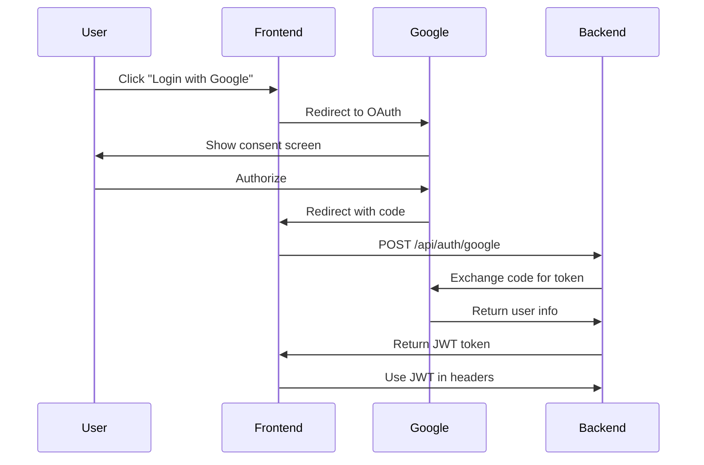

# API Documentation
## Real-Time Multiplayer Grid Game

### Version: 1.0
### Base URL: `https://api.gridgame.com/v1`

---

## Table of Contents
1. [Authentication](#authentication)
2. [REST API Endpoints](#rest-api-endpoints)
3. [WebSocket Events](#websocket-events)
4. [Error Handling](#error-handling)
5. [Rate Limiting](#rate-limiting)
6. [Examples](#examples)

---

## Authentication

### OAuth 2.0 Flow
The application uses Google OAuth 2.0 for authentication.



### JWT Token Structure
```json
{
  "userId": "550e8400-e29b-41d4-a716-446655440000",
  "email": "user@example.com",
  "name": "John Doe",
  "iat": 1643723400,
  "exp": 1643809800
}
```

### Authorization Header
```http
Authorization: Bearer <jwt_token>
```

---

## REST API Endpoints

### Authentication Endpoints

#### **POST** `/api/auth/google`
Exchange Google OAuth code for JWT token.

**Request Body:**
```json
{
  "code": "4/0AX4XfWh...",
  "redirectUri": "http://localhost:3000/auth/callback"
}
```

**Response:**
```json
{
  "token": "eyJhbGciOiJIUzI1NiIs...",
  "user": {
    "id": "550e8400-e29b-41d4-a716-446655440000",
    "email": "user@example.com",
    "name": "John Doe",
    "avatarUrl": "https://lh3.googleusercontent.com/...",
    "preferredColor": "#FF5733"
  }
}
```

#### **GET** `/api/auth/me`
Get current authenticated user.

**Headers:**
```http
Authorization: Bearer <jwt_token>
```

**Response:**
```json
{
  "id": "550e8400-e29b-41d4-a716-446655440000",
  "email": "user@example.com",
  "name": "John Doe",
  "avatarUrl": "https://lh3.googleusercontent.com/...",
  "preferredColor": "#FF5733",
  "createdAt": "2024-01-15T10:30:00Z"
}
```

#### **POST** `/api/auth/logout`
Logout current user.

**Headers:**
```http
Authorization: Bearer <jwt_token>
```

**Response:**
```json
{
  "message": "Successfully logged out"
}
```

### Game Management Endpoints

#### **POST** `/api/games`
Create a new game.

**Headers:**
```http
Authorization: Bearer <jwt_token>
Content-Type: application/json
```

**Request Body:**
```json
{
  "boardSize": 8,
  "name": "Friday Night Game",
  "maxPlayers": 4
}
```

**Response:**
```json
{
  "id": "game_2KqJd8Hs9",
  "creatorId": "550e8400-e29b-41d4-a716-446655440000",
  "boardSize": 8,
  "name": "Friday Night Game",
  "maxPlayers": 4,
  "status": "waiting",
  "inviteCode": "GAME2024",
  "createdAt": "2024-01-15T10:30:00Z"
}
```

#### **GET** `/api/games`
List active games.

**Query Parameters:**
- `status` (optional): `waiting`, `in_progress`, `completed`
- `limit` (optional): Number of results (default: 20, max: 100)
- `offset` (optional): Pagination offset

**Response:**
```json
{
  "games": [
    {
      "id": "game_2KqJd8Hs9",
      "name": "Friday Night Game",
      "creatorName": "John Doe",
      "boardSize": 8,
      "playerCount": 2,
      "maxPlayers": 4,
      "status": "waiting",
      "createdAt": "2024-01-15T10:30:00Z"
    }
  ],
  "total": 45,
  "limit": 20,
  "offset": 0
}
```

#### **GET** `/api/games/:gameId`
Get detailed game information.

**Response:**
```json
{
  "id": "game_2KqJd8Hs9",
  "creator": {
    "id": "550e8400-e29b-41d4-a716-446655440000",
    "name": "John Doe",
    "avatarUrl": "https://..."
  },
  "boardSize": 8,
  "name": "Friday Night Game",
  "status": "in_progress",
  "players": [
    {
      "userId": "550e8400-e29b-41d4-a716-446655440000",
      "name": "John Doe",
      "color": "#FF5733",
      "cellsOwned": 12,
      "isOnline": true
    }
  ],
  "board": [
    ["user1", null, "user2", null],
    [null, "user1", null, "user2"],
    ["user2", null, "user1", null],
    [null, null, null, null]
  ],
  "startedAt": "2024-01-15T10:35:00Z",
  "endedAt": null
}
```

#### **POST** `/api/games/:gameId/invite`
Invite users to a game.

**Request Body:**
```json
{
  "userIds": [
    "660e8400-e29b-41d4-a716-446655440001",
    "770e8400-e29b-41d4-a716-446655440002"
  ]
}
```

**Response:**
```json
{
  "invited": [
    {
      "userId": "660e8400-e29b-41d4-a716-446655440001",
      "status": "pending"
    }
  ],
  "failed": []
}
```

#### **POST** `/api/games/:gameId/join`
Join a game.

**Request Body:**
```json
{
  "inviteCode": "GAME2024",
  "color": "#00FF00"
}
```

**Response:**
```json
{
  "gameId": "game_2KqJd8Hs9",
  "status": "joined",
  "assignedColor": "#00FF00"
}
```

#### **POST** `/api/games/:gameId/start`
Start a game (creator only).

**Response:**
```json
{
  "gameId": "game_2KqJd8Hs9",
  "status": "in_progress",
  "startedAt": "2024-01-15T10:35:00Z"
}
```

### User Endpoints

#### **GET** `/api/users/search`
Search for users to invite.

**Query Parameters:**
- `q`: Search query (username or email)
- `limit`: Max results (default: 10)

**Response:**
```json
{
  "users": [
    {
      "id": "660e8400-e29b-41d4-a716-446655440001",
      "name": "Jane Smith",
      "email": "jane@example.com",
      "avatarUrl": "https://..."
    }
  ]
}
```

#### **PATCH** `/api/users/profile`
Update user profile.

**Request Body:**
```json
{
  "name": "John Updated",
  "preferredColor": "#0000FF"
}
```

**Response:**
```json
{
  "id": "550e8400-e29b-41d4-a716-446655440000",
  "name": "John Updated",
  "preferredColor": "#0000FF",
  "updatedAt": "2024-01-15T11:00:00Z"
}
```

---

## WebSocket Events

### Connection

**WebSocket URL:** `wss://api.gridgame.com/socket.io`

**Connection with Authentication:**
```javascript
const socket = io('wss://api.gridgame.com', {
  auth: {
    token: 'Bearer eyJhbGciOiJIUzI1NiIs...'
  }
});
```

### Client → Server Events

#### `authenticate`
Authenticate the WebSocket connection.
```javascript
socket.emit('authenticate', {
  token: 'eyJhbGciOiJIUzI1NiIs...'
});
```

#### `game:join`
Join a game room for real-time updates.
```javascript
socket.emit('game:join', {
  gameId: 'game_2KqJd8Hs9'
});
```

#### `game:leave`
Leave a game room.
```javascript
socket.emit('game:leave', {
  gameId: 'game_2KqJd8Hs9'
});
```

#### `game:click_cell`
Attempt to claim a cell.
```javascript
socket.emit('game:click_cell', {
  gameId: 'game_2KqJd8Hs9',
  x: 3,
  y: 4
});
```

#### `game:subscribe`
Subscribe to game updates.
```javascript
socket.emit('game:subscribe', {
  gameId: 'game_2KqJd8Hs9'
});
```

### Server → Client Events

#### `authenticated`
Confirmation of successful authentication.
```javascript
socket.on('authenticated', (data) => {
  console.log('Authenticated as:', data.userId);
});
```

#### `error`
Error notifications.
```javascript
socket.on('error', (error) => {
  console.error('Error:', error.code, error.message);
});
```

**Error Codes:**
- `AUTH_FAILED`: Authentication failed
- `GAME_NOT_FOUND`: Game doesn't exist
- `GAME_FULL`: Game is at max capacity
- `CELL_TAKEN`: Cell already claimed
- `NOT_YOUR_TURN`: Not the player's turn
- `RATE_LIMITED`: Too many requests

#### `game:state`
Full game state update.
```javascript
socket.on('game:state', (game) => {
  console.log('Game state:', game);
  // Update UI with complete game state
});
```

#### `game:player_joined`
New player joined the game.
```javascript
socket.on('game:player_joined', (data) => {
  console.log('Player joined:', data.user.name);
});
```

#### `game:player_left`
Player left the game.
```javascript
socket.on('game:player_left', (data) => {
  console.log('Player left:', data.userId);
});
```

#### `game:started`
Game has started.
```javascript
socket.on('game:started', (data) => {
  console.log('Game started:', data.gameId);
});
```

#### `game:cell_claimed`
Cell successfully claimed.
```javascript
socket.on('game:cell_claimed', (data) => {
  console.log(`Cell (${data.x}, ${data.y}) claimed by ${data.userId}`);
  // Update cell color to data.color
});
```

#### `game:cell_failed`
Cell claim failed.
```javascript
socket.on('game:cell_failed', (data) => {
  console.log(`Failed to claim (${data.x}, ${data.y}): ${data.reason}`);
});
```

#### `game:batch_update`
Multiple cell updates (performance optimization).
```javascript
socket.on('game:batch_update', (data) => {
  data.updates.forEach(update => {
    // Apply each cell update
  });
});
```

#### `game:ended`
Game has ended.
```javascript
socket.on('game:ended', (data) => {
  console.log('Winner:', data.winner.name);
  console.log('Final scores:', data.scores);
});
```

---

## Error Handling

### HTTP Error Response Format
```json
{
  "error": {
    "code": "VALIDATION_ERROR",
    "message": "Board size must be between 4 and 16",
    "field": "boardSize",
    "timestamp": "2024-01-15T10:30:00Z"
  }
}
```

### HTTP Status Codes
- `200 OK`: Success
- `201 Created`: Resource created
- `400 Bad Request`: Invalid request
- `401 Unauthorized`: Missing/invalid auth
- `403 Forbidden`: Insufficient permissions
- `404 Not Found`: Resource not found
- `409 Conflict`: Resource conflict
- `429 Too Many Requests`: Rate limited
- `500 Internal Server Error`: Server error

### WebSocket Error Events
```javascript
socket.on('error', (error) => {
  switch(error.code) {
    case 'AUTH_FAILED':
      // Handle authentication failure
      break;
    case 'CELL_TAKEN':
      // Handle cell already claimed
      break;
    case 'RATE_LIMITED':
      // Handle rate limiting
      break;
  }
});
```

---

## Rate Limiting

### Limits
- **API Requests**: 100 requests per minute per user
- **Cell Clicks**: 10 clicks per second per user
- **Game Creation**: 10 games per hour per user
- **WebSocket Messages**: 50 messages per second per connection

### Rate Limit Headers
```http
X-RateLimit-Limit: 100
X-RateLimit-Remaining: 45
X-RateLimit-Reset: 1643723460
```

### Rate Limit Response
```json
{
  "error": {
    "code": "RATE_LIMITED",
    "message": "Too many requests",
    "retryAfter": 30
  }
}
```

---

## Examples

### Complete Game Flow Example

```javascript
// 1. Authenticate
const response = await fetch('/api/auth/google', {
  method: 'POST',
  body: JSON.stringify({ code: authCode }),
  headers: { 'Content-Type': 'application/json' }
});
const { token } = await response.json();

// 2. Create WebSocket connection
const socket = io('wss://api.gridgame.com', {
  auth: { token: `Bearer ${token}` }
});

// 3. Create a game
const gameResponse = await fetch('/api/games', {
  method: 'POST',
  headers: {
    'Authorization': `Bearer ${token}`,
    'Content-Type': 'application/json'
  },
  body: JSON.stringify({
    boardSize: 8,
    name: 'My Game'
  })
});
const game = await gameResponse.json();

// 4. Subscribe to game updates
socket.emit('game:subscribe', { gameId: game.id });

// 5. Listen for game events
socket.on('game:player_joined', (data) => {
  updatePlayerList(data.user);
});

socket.on('game:cell_claimed', (data) => {
  updateCell(data.x, data.y, data.color);
});

// 6. Start the game
await fetch(`/api/games/${game.id}/start`, {
  method: 'POST',
  headers: { 'Authorization': `Bearer ${token}` }
});

// 7. Play the game
socket.emit('game:click_cell', {
  gameId: game.id,
  x: 3,
  y: 4
});

// 8. Handle game end
socket.on('game:ended', (data) => {
  showWinner(data.winner, data.scores);
});
```

### Error Handling Example

```javascript
// Global error handler for API calls
async function apiCall(url, options = {}) {
  try {
    const response = await fetch(url, {
      ...options,
      headers: {
        'Authorization': `Bearer ${getToken()}`,
        'Content-Type': 'application/json',
        ...options.headers
      }
    });
    
    if (!response.ok) {
      const error = await response.json();
      throw new ApiError(error.error.code, error.error.message);
    }
    
    return await response.json();
  } catch (error) {
    if (error.code === 'RATE_LIMITED') {
      // Show rate limit message
      showNotification('Please slow down!', 'warning');
    } else if (error.code === 'AUTH_FAILED') {
      // Redirect to login
      redirectToLogin();
    } else {
      // Generic error handling
      showNotification(error.message, 'error');
    }
    throw error;
  }
}

// WebSocket error handling
socket.on('error', (error) => {
  handleWebSocketError(error);
});

socket.on('disconnect', (reason) => {
  if (reason === 'io server disconnect') {
    // Server disconnected, try to reconnect
    showNotification('Connection lost. Reconnecting...', 'info');
  }
});
```

### Reconnection Handling

```javascript
// Configure Socket.io with reconnection
const socket = io('wss://api.gridgame.com', {
  auth: { token: `Bearer ${token}` },
  reconnection: true,
  reconnectionDelay: 1000,
  reconnectionDelayMax: 5000,
  reconnectionAttempts: 5
});

// Handle reconnection events
socket.on('reconnect', (attemptNumber) => {
  console.log('Reconnected after', attemptNumber, 'attempts');
  // Resubscribe to game rooms
  if (currentGameId) {
    socket.emit('game:subscribe', { gameId: currentGameId });
  }
});

socket.on('reconnect_error', (error) => {
  console.error('Reconnection error:', error);
});

socket.on('reconnect_failed', () => {
  showNotification('Failed to reconnect. Please refresh the page.', 'error');
});
```