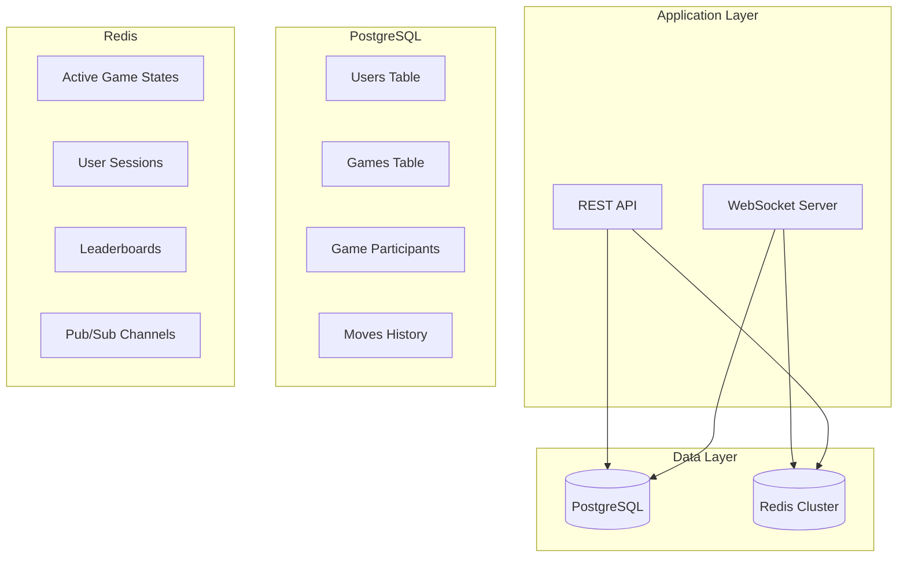
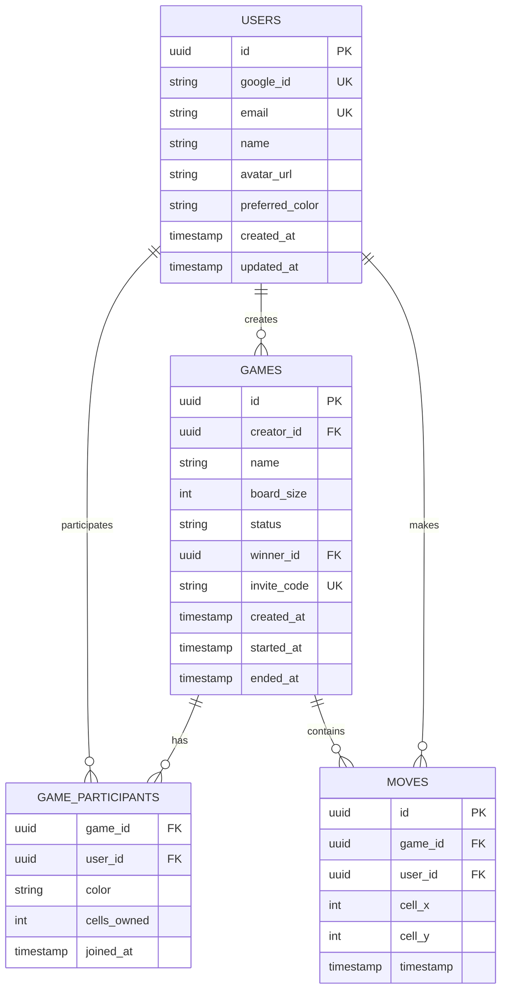
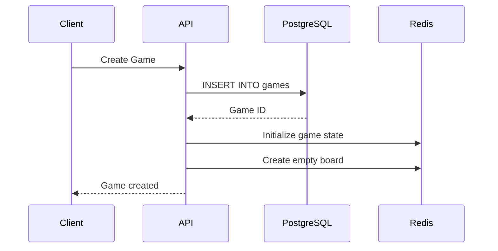
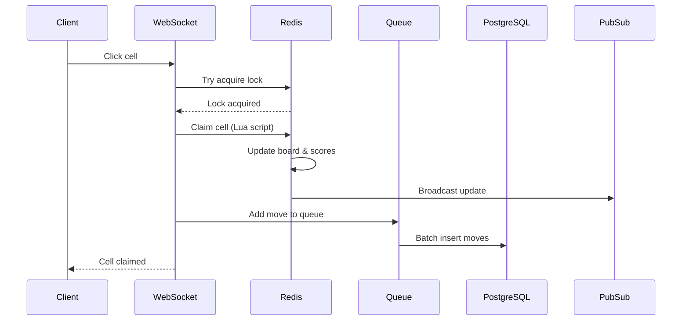

# Database Design Document
## Real-Time Multiplayer Grid Game

### Version: 1.0
### Date: January 2025

---

## Table of Contents
1. [Overview](#overview)
2. [Database Architecture](#database-architecture)
3. [PostgreSQL Schema](#postgresql-schema)
4. [Redis Data Structures](#redis-data-structures)
5. [Data Flow](#data-flow)
6. [Indexing Strategy](#indexing-strategy)
7. [Data Integrity](#data-integrity)
8. [Performance Considerations](#performance-considerations)
9. [Backup and Recovery](#backup-and-recovery)

---

## Overview

This document describes the database design for the real-time multiplayer grid game. The system uses a hybrid approach:
- **PostgreSQL**: Primary data store for persistent data (users, game history)
- **Redis**: In-memory store for real-time game state and caching

### Design Principles
1. **Separation of Concerns**: Real-time data in Redis, persistent data in PostgreSQL
2. **Data Consistency**: ACID compliance for critical data
3. **Performance**: Optimized for read-heavy workloads
4. **Scalability**: Horizontal scaling capabilities

---

## Database Architecture



---

## PostgreSQL Schema

### Entity Relationship Diagram



### Table Definitions

#### **users**
Stores user account information from Google OAuth.

```sql
CREATE TABLE users (
    id UUID DEFAULT gen_random_uuid() PRIMARY KEY,
    google_id VARCHAR(255) UNIQUE NOT NULL,
    email VARCHAR(255) UNIQUE NOT NULL,
    name VARCHAR(100) NOT NULL,
    avatar_url VARCHAR(500),
    preferred_color VARCHAR(7) DEFAULT '#FF5733',
    created_at TIMESTAMP WITH TIME ZONE DEFAULT CURRENT_TIMESTAMP,
    updated_at TIMESTAMP WITH TIME ZONE DEFAULT CURRENT_TIMESTAMP,
    CONSTRAINT valid_color CHECK (preferred_color ~ '^#[0-9A-Fa-f]{6}$')
);

-- Indexes
CREATE INDEX idx_users_email ON users(email);
CREATE INDEX idx_users_google_id ON users(google_id);
CREATE INDEX idx_users_created_at ON users(created_at DESC);
```

#### **games**
Stores game session information.

```sql
CREATE TYPE game_status AS ENUM ('waiting', 'in_progress', 'completed', 'cancelled');

CREATE TABLE games (
    id UUID DEFAULT gen_random_uuid() PRIMARY KEY,
    creator_id UUID NOT NULL REFERENCES users(id) ON DELETE CASCADE,
    name VARCHAR(100) NOT NULL,
    board_size INTEGER NOT NULL CHECK (board_size >= 4 AND board_size <= 16),
    max_players INTEGER DEFAULT 4 CHECK (max_players >= 2 AND max_players <= 10),
    status game_status DEFAULT 'waiting',
    winner_id UUID REFERENCES users(id) ON DELETE SET NULL,
    invite_code VARCHAR(8) UNIQUE,
    created_at TIMESTAMP WITH TIME ZONE DEFAULT CURRENT_TIMESTAMP,
    started_at TIMESTAMP WITH TIME ZONE,
    ended_at TIMESTAMP WITH TIME ZONE,
    CONSTRAINT valid_game_state CHECK (
        (status = 'waiting' AND started_at IS NULL AND ended_at IS NULL) OR
        (status = 'in_progress' AND started_at IS NOT NULL AND ended_at IS NULL) OR
        (status IN ('completed', 'cancelled') AND ended_at IS NOT NULL)
    )
);

-- Indexes
CREATE INDEX idx_games_creator_id ON games(creator_id);
CREATE INDEX idx_games_status ON games(status);
CREATE INDEX idx_games_created_at ON games(created_at DESC);
CREATE INDEX idx_games_invite_code ON games(invite_code) WHERE invite_code IS NOT NULL;
```

#### **game_participants**
Junction table for users participating in games.

```sql
CREATE TABLE game_participants (
    game_id UUID REFERENCES games(id) ON DELETE CASCADE,
    user_id UUID REFERENCES users(id) ON DELETE CASCADE,
    color VARCHAR(7) NOT NULL,
    cells_owned INTEGER DEFAULT 0,
    is_active BOOLEAN DEFAULT true,
    joined_at TIMESTAMP WITH TIME ZONE DEFAULT CURRENT_TIMESTAMP,
    left_at TIMESTAMP WITH TIME ZONE,
    PRIMARY KEY (game_id, user_id),
    CONSTRAINT valid_participant_color CHECK (color ~ '^#[0-9A-Fa-f]{6}$'),
    CONSTRAINT valid_cells_owned CHECK (cells_owned >= 0)
);

-- Indexes
CREATE INDEX idx_participants_user_id ON game_participants(user_id);
CREATE INDEX idx_participants_game_active ON game_participants(game_id) 
    WHERE is_active = true;
```

#### **moves**
Stores move history for game replay and analytics.

```sql
CREATE TABLE moves (
    id UUID DEFAULT gen_random_uuid() PRIMARY KEY,
    game_id UUID NOT NULL REFERENCES games(id) ON DELETE CASCADE,
    user_id UUID NOT NULL REFERENCES users(id) ON DELETE CASCADE,
    cell_x INTEGER NOT NULL,
    cell_y INTEGER NOT NULL,
    timestamp TIMESTAMP WITH TIME ZONE DEFAULT CURRENT_TIMESTAMP,
    CONSTRAINT valid_cell_position CHECK (cell_x >= 0 AND cell_y >= 0)
);

-- Indexes
CREATE INDEX idx_moves_game_id_timestamp ON moves(game_id, timestamp);
CREATE INDEX idx_moves_user_id ON moves(user_id);
CREATE INDEX idx_moves_game_cell ON moves(game_id, cell_x, cell_y);

-- Partitioning by month for better performance
CREATE TABLE moves_2024_01 PARTITION OF moves
    FOR VALUES FROM ('2024-01-01') TO ('2024-02-01');
```

### Views

#### **v_game_statistics**
Aggregated game statistics view.

```sql
CREATE VIEW v_game_statistics AS
SELECT 
    g.id,
    g.name,
    g.board_size,
    g.status,
    g.created_at,
    g.started_at,
    g.ended_at,
    u.name as creator_name,
    w.name as winner_name,
    COUNT(DISTINCT gp.user_id) as player_count,
    COUNT(DISTINCT m.id) as total_moves,
    EXTRACT(EPOCH FROM (g.ended_at - g.started_at))/60 as duration_minutes
FROM games g
LEFT JOIN users u ON g.creator_id = u.id
LEFT JOIN users w ON g.winner_id = w.id
LEFT JOIN game_participants gp ON g.id = gp.game_id
LEFT JOIN moves m ON g.id = m.game_id
GROUP BY g.id, u.name, w.name;
```

#### **v_user_stats**
User performance statistics.

```sql
CREATE VIEW v_user_stats AS
SELECT 
    u.id,
    u.name,
    COUNT(DISTINCT g.id) as games_created,
    COUNT(DISTINCT gp.game_id) as games_played,
    COUNT(DISTINCT CASE WHEN g2.winner_id = u.id THEN g2.id END) as games_won,
    AVG(gp.cells_owned) as avg_cells_per_game,
    MAX(gp.cells_owned) as max_cells_in_game
FROM users u
LEFT JOIN games g ON u.id = g.creator_id
LEFT JOIN game_participants gp ON u.id = gp.user_id
LEFT JOIN games g2 ON gp.game_id = g2.id
GROUP BY u.id, u.name;
```

### Functions and Procedures

#### **generate_invite_code()**
Generate unique invite codes for games.

```sql
CREATE OR REPLACE FUNCTION generate_invite_code()
RETURNS VARCHAR(8) AS $$
DECLARE
    chars VARCHAR(62) := 'ABCDEFGHIJKLMNOPQRSTUVWXYZ0123456789';
    result VARCHAR(8) := '';
    i INTEGER;
BEGIN
    FOR i IN 1..8 LOOP
        result := result || substr(chars, floor(random() * length(chars) + 1)::int, 1);
    END LOOP;
    RETURN result;
END;
$$ LANGUAGE plpgsql;

-- Trigger to auto-generate invite codes
CREATE TRIGGER set_invite_code
    BEFORE INSERT ON games
    FOR EACH ROW
    EXECUTE FUNCTION generate_invite_code();
```

#### **update_timestamp()**
Auto-update timestamp function.

```sql
CREATE OR REPLACE FUNCTION update_timestamp()
RETURNS TRIGGER AS $$
BEGIN
    NEW.updated_at = CURRENT_TIMESTAMP;
    RETURN NEW;
END;
$$ LANGUAGE plpgsql;

CREATE TRIGGER update_users_timestamp
    BEFORE UPDATE ON users
    FOR EACH ROW
    EXECUTE FUNCTION update_timestamp();
```

---

## Redis Data Structures

### Key Naming Convention
```
game:{gameId}:state          # Hash - Current game state
game:{gameId}:board          # Hash - Board cell ownership
game:{gameId}:players        # Set - Active players
game:{gameId}:scores         # ZSet - Player scores
user:{userId}:session        # Hash - User session data
user:{userId}:games          # Set - User's active games
lock:game:{gameId}:cell:{x}:{y}  # String - Cell lock for concurrency
queue:moves                  # List - Move processing queue
leaderboard:daily           # ZSet - Daily leaderboard
leaderboard:weekly          # ZSet - Weekly leaderboard
leaderboard:alltime         # ZSet - All-time leaderboard
```

### Data Structure Definitions

#### **Game State Hash**
```redis
game:{gameId}:state
{
    "id": "game_2KqJd8Hs9",
    "creatorId": "550e8400-e29b-41d4-a716-446655440000",
    "boardSize": 8,
    "status": "in_progress",
    "playerCount": 4,
    "totalCells": 64,
    "filledCells": 23,
    "startedAt": "1643723400",
    "lastMoveAt": "1643723456"
}
```

#### **Board State Hash**
```redis
game:{gameId}:board
{
    "0:0": "userId1",
    "0:1": "userId2",
    "1:0": "userId1",
    "3:4": "userId3",
    ...
}
```

#### **Player Scores Sorted Set**
```redis
game:{gameId}:scores
userId1 -> 12 (score = cells owned)
userId2 -> 10
userId3 -> 8
userId4 -> 5
```

#### **Session Management**
```redis
user:{userId}:session
{
    "socketId": "socket_abc123",
    "connectedAt": "1643723400",
    "lastActivity": "1643723456",
    "currentGame": "game_2KqJd8Hs9",
    "status": "online"
}
```

### Pub/Sub Channels

#### **Channel Structure**
```
game:{gameId}          # Game-specific events
user:{userId}          # User-specific notifications
broadcast             # System-wide announcements
game:{gameId}:moves   # Move stream for game
```

#### **Message Format**
```json
{
    "type": "cell_claimed",
    "gameId": "game_2KqJd8Hs9",
    "userId": "550e8400-e29b-41d4-a716-446655440000",
    "data": {
        "x": 3,
        "y": 4,
        "color": "#FF5733"
    },
    "timestamp": 1643723456
}
```

### Redis Lua Scripts

#### **Atomic Cell Claim**
```lua
-- claim_cell.lua
local gameId = KEYS[1]
local x = ARGV[1]
local y = ARGV[2]
local userId = ARGV[3]
local color = ARGV[4]

local boardKey = 'game:' .. gameId .. ':board'
local scoresKey = 'game:' .. gameId .. ':scores'
local stateKey = 'game:' .. gameId .. ':state'
local cellKey = x .. ':' .. y

-- Check if cell is already taken
local currentOwner = redis.call('HGET', boardKey, cellKey)
if currentOwner then
    return {0, 'cell_taken'}
end

-- Claim the cell
redis.call('HSET', boardKey, cellKey, userId)
redis.call('ZINCRBY', scoresKey, 1, userId)
redis.call('HINCRBY', stateKey, 'filledCells', 1)
redis.call('HSET', stateKey, 'lastMoveAt', ARGV[5])

-- Publish event
local event = cjson.encode({
    type = 'cell_claimed',
    userId = userId,
    x = tonumber(x),
    y = tonumber(y),
    color = color,
    timestamp = tonumber(ARGV[5])
})
redis.call('PUBLISH', 'game:' .. gameId, event)

return {1, 'success'}
```

---

## Data Flow

### Game Creation Flow


### Move Processing Flow


---

## Indexing Strategy

### PostgreSQL Indexes

#### **Performance Indexes**
1. **Primary Keys**: Automatically indexed
2. **Foreign Keys**: Index on referencing columns
3. **Query Patterns**: 
   - Games by status and date
   - User's active games
   - Game participants lookup
   - Move history by game

#### **Index Analysis**
```sql
-- Most common queries and their indexes
-- 1. Find user's active games
SELECT g.* FROM games g
JOIN game_participants gp ON g.id = gp.game_id
WHERE gp.user_id = ? AND g.status IN ('waiting', 'in_progress');
-- Uses: idx_participants_user_id, idx_games_status

-- 2. Get game moves in order
SELECT * FROM moves 
WHERE game_id = ? 
ORDER BY timestamp;
-- Uses: idx_moves_game_id_timestamp

-- 3. Find games to join
SELECT * FROM games 
WHERE status = 'waiting' 
ORDER BY created_at DESC 
LIMIT 20;
-- Uses: idx_games_status, idx_games_created_at
```

### Redis Key Expiration

```redis
# Session keys expire after 24 hours
SETEX user:{userId}:session 86400 {data}

# Game state expires 7 days after completion
EXPIRE game:{gameId}:state 604800

# Cell locks expire after 100ms
SET lock:game:{gameId}:cell:{x}:{y} {userId} PX 100 NX
```

---

## Data Integrity

### Constraints

#### **PostgreSQL Constraints**
1. **Referential Integrity**: Foreign keys with appropriate CASCADE rules
2. **Check Constraints**: Valid colors, board sizes, cell positions
3. **Unique Constraints**: Email, Google ID, invite codes
4. **Business Rules**: Game state transitions

#### **Redis Data Validation**
1. **Lua Scripts**: Atomic operations with validation
2. **Key Patterns**: Consistent naming prevents conflicts
3. **TTL Management**: Automatic cleanup of stale data

### Transaction Management

#### **PostgreSQL Transactions**
```sql
BEGIN;
    -- Update game status
    UPDATE games SET status = 'completed', ended_at = NOW() 
    WHERE id = ?;
    
    -- Update winner
    UPDATE games SET winner_id = ? WHERE id = ?;
    
    -- Update final scores
    UPDATE game_participants 
    SET cells_owned = ? 
    WHERE game_id = ? AND user_id = ?;
COMMIT;
```

#### **Redis Transactions**
```redis
MULTI
    HSET game:{gameId}:state status completed
    ZADD leaderboard:daily {score} {userId}
    DEL game:{gameId}:players
EXEC
```

---

## Performance Considerations

### Query Optimization

#### **Slow Query Analysis**
```sql
-- Enable query logging
ALTER SYSTEM SET log_min_duration_statement = 100;

-- Common slow query patterns
EXPLAIN ANALYZE
SELECT g.*, COUNT(gp.user_id) as player_count
FROM games g
LEFT JOIN game_participants gp ON g.id = gp.game_id
WHERE g.status = 'waiting'
GROUP BY g.id
ORDER BY g.created_at DESC
LIMIT 20;
```

#### **Optimization Techniques**
1. **Materialized Views**: For complex statistics
2. **Partial Indexes**: For filtered queries
3. **Table Partitioning**: For moves history
4. **Connection Pooling**: PgBouncer configuration

### Redis Performance

#### **Memory Optimization**
```redis
# Use hash field compression
CONFIG SET hash-max-ziplist-entries 512
CONFIG SET hash-max-ziplist-value 64

# Enable key eviction
CONFIG SET maxmemory 4gb
CONFIG SET maxmemory-policy allkeys-lru
```

#### **Pipeline Operations**
```javascript
// Batch Redis operations
const pipeline = redis.pipeline();
updates.forEach(update => {
    pipeline.hset(`game:${gameId}:board`, `${update.x}:${update.y}`, update.userId);
    pipeline.zincrby(`game:${gameId}:scores`, 1, update.userId);
});
await pipeline.exec();
```

---

## Backup and Recovery

### PostgreSQL Backup Strategy

#### **Continuous Archiving**
```bash
# postgresql.conf
archive_mode = on
archive_command = 'aws s3 cp %p s3://backup/postgres/wal/%f'

# Daily base backups
pg_basebackup -D /backup/base -Ft -z -P
```

#### **Backup Schedule**
- **Full Backup**: Daily at 2 AM
- **WAL Archives**: Continuous
- **Retention**: 30 days
- **Off-site**: AWS S3 with lifecycle policies

### Redis Persistence

#### **Configuration**
```redis
# Append-only file
appendonly yes
appendfsync everysec

# RDB snapshots
save 900 1      # After 900 sec if at least 1 key changed
save 300 10     # After 300 sec if at least 10 keys changed
save 60 10000   # After 60 sec if at least 10000 keys changed
```

#### **Backup Process**
```bash
# Redis backup script
#!/bin/bash
redis-cli BGSAVE
sleep 10
aws s3 cp /var/lib/redis/dump.rdb s3://backup/redis/dump-$(date +%Y%m%d-%H%M%S).rdb
```

### Disaster Recovery Plan

#### **Recovery Time Objectives**
- **RTO**: 1 hour
- **RPO**: 5 minutes

#### **Recovery Procedures**
1. **Database Failure**: Promote read replica
2. **Redis Failure**: Restore from latest RDB + replay AOF
3. **Complete Failure**: Restore from S3 backups

### Monitoring and Alerts

```sql
-- PostgreSQL monitoring queries
-- Connection count
SELECT count(*) FROM pg_stat_activity;

-- Long running queries
SELECT pid, age(clock_timestamp(), query_start), query 
FROM pg_stat_activity 
WHERE state != 'idle' 
AND query_start < current_timestamp - interval '1 minute';

-- Table sizes
SELECT schemaname, tablename, 
       pg_size_pretty(pg_total_relation_size(schemaname||'.'||tablename))
FROM pg_tables 
ORDER BY pg_total_relation_size(schemaname||'.'||tablename) DESC;
```

---

## Migration Scripts

### Initial Setup
```sql
-- V001_initial_schema.sql
CREATE DATABASE gridgame;
\c gridgame;

-- Create extensions
CREATE EXTENSION IF NOT EXISTS "uuid-ossp";
CREATE EXTENSION IF NOT EXISTS "pg_stat_statements";

-- Run all CREATE TABLE statements
-- Run all CREATE INDEX statements
-- Run all CREATE FUNCTION statements
```

### Version Control
Using Flyway for database migrations:
```
migrations/
├── V001__initial_schema.sql
├── V002__add_leaderboard_tables.sql
├── V003__add_game_modes.sql
└── V004__performance_indexes.sql
```