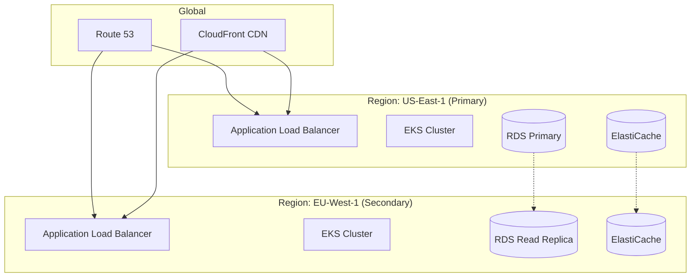

# Deployment and DevOps Plan
## Real-Time Multiplayer Grid Game

### Version: 1.0
### Date: January 2025

---

## Table of Contents
1. [Overview](#overview)
2. [Infrastructure Architecture](#infrastructure-architecture)
3. [Container Strategy](#container-strategy)
4. [Kubernetes Deployment](#kubernetes-deployment)
5. [CI/CD Pipeline](#cicd-pipeline)
6. [Monitoring & Observability](#monitoring--observability)
7. [Scaling Strategy](#scaling-strategy)
8. [Disaster Recovery](#disaster-recovery)
9. [Cost Optimization](#cost-optimization)

---

## Overview

This document outlines the deployment and DevOps strategy for the real-time multiplayer grid game. The plan focuses on scalability, reliability, and maintainability using modern cloud-native practices.

### Key Objectives
- **Zero-downtime deployments**
- **Auto-scaling based on load**
- **Multi-region availability**
- **Cost-efficient resource usage**
- **Comprehensive monitoring**

### Technology Stack
- **Container**: Docker
- **Orchestration**: Kubernetes (EKS)
- **CI/CD**: GitHub Actions + ArgoCD
- **Monitoring**: Prometheus + Grafana
- **Logging**: ELK Stack
- **Cloud Provider**: AWS

---

## Infrastructure Architecture

### Multi-Region Architecture



### AWS Services Architecture

```yaml
Infrastructure:
  Compute:
    - EKS (Kubernetes clusters)
    - EC2 (Node groups)
    - Lambda (Serverless functions)
  
  Storage:
    - RDS PostgreSQL (Multi-AZ)
    - ElastiCache Redis (Cluster mode)
    - S3 (Static assets, backups)
    - EFS (Shared storage)
  
  Networking:
    - VPC (10.0.0.0/16)
    - Application Load Balancers
    - CloudFront CDN
    - Route 53 (DNS)
    
  Security:
    - WAF (Web Application Firewall)
    - Secrets Manager
    - Certificate Manager
    - IAM roles and policies
```

---

## Container Strategy

### Docker Images

#### **Backend Dockerfile**
```dockerfile
# Build stage
FROM node:18-alpine AS builder
WORKDIR /app
COPY package*.json ./
RUN npm ci --only=production
COPY . .
RUN npm run build

# Runtime stage
FROM node:18-alpine
RUN apk add --no-cache dumb-init
WORKDIR /app
COPY --from=builder /app/dist ./dist
COPY --from=builder /app/node_modules ./node_modules
COPY --from=builder /app/package*.json ./
USER node
EXPOSE 3000
ENTRYPOINT ["dumb-init", "--"]
CMD ["node", "dist/app.js"]
```

#### **Frontend Dockerfile**
```dockerfile
# Build stage
FROM node:18-alpine AS builder
WORKDIR /app
COPY package*.json ./
RUN npm ci
COPY . .
RUN npm run build

# Runtime stage
FROM nginx:alpine
COPY --from=builder /app/build /usr/share/nginx/html
COPY nginx.conf /etc/nginx/nginx.conf
EXPOSE 80
CMD ["nginx", "-g", "daemon off;"]
```

### Image Registry Strategy

```yaml
Registry:
  Location: AWS ECR
  Repositories:
    - gridgame/backend
    - gridgame/frontend
    - gridgame/websocket
    
  Tagging Strategy:
    - latest (development)
    - staging-{commit-sha}
    - prod-{version}-{commit-sha}
    
  Retention Policy:
    Production: Keep last 20 images
    Staging: Keep last 10 images
    Development: Keep last 5 images
```

---

## Kubernetes Deployment

### Namespace Structure

```yaml
apiVersion: v1
kind: Namespace
metadata:
  name: gridgame-prod
---
apiVersion: v1
kind: Namespace
metadata:
  name: gridgame-staging
---
apiVersion: v1
kind: Namespace
metadata:
  name: gridgame-monitoring
```

### Backend Deployment

```yaml
apiVersion: apps/v1
kind: Deployment
metadata:
  name: backend-api
  namespace: gridgame-prod
spec:
  replicas: 3
  selector:
    matchLabels:
      app: backend-api
  template:
    metadata:
      labels:
        app: backend-api
    spec:
      containers:
      - name: backend
        image: 123456789.dkr.ecr.us-east-1.amazonaws.com/gridgame/backend:prod-1.0.0
        ports:
        - containerPort: 3000
        env:
        - name: NODE_ENV
          value: "production"
        - name: DATABASE_URL
          valueFrom:
            secretKeyRef:
              name: db-credentials
              key: url
        - name: REDIS_URL
          valueFrom:
            secretKeyRef:
              name: redis-credentials
              key: url
        resources:
          requests:
            memory: "256Mi"
            cpu: "250m"
          limits:
            memory: "512Mi"
            cpu: "500m"
        livenessProbe:
          httpGet:
            path: /health
            port: 3000
          initialDelaySeconds: 30
          periodSeconds: 10
        readinessProbe:
          httpGet:
            path: /ready
            port: 3000
          initialDelaySeconds: 5
          periodSeconds: 5
```

### WebSocket Deployment

```yaml
apiVersion: apps/v1
kind: Deployment
metadata:
  name: websocket-server
  namespace: gridgame-prod
spec:
  replicas: 5
  selector:
    matchLabels:
      app: websocket-server
  template:
    metadata:
      labels:
        app: websocket-server
    spec:
      affinity:
        podAntiAffinity:
          preferredDuringSchedulingIgnoredDuringExecution:
          - weight: 100
            podAffinityTerm:
              labelSelector:
                matchExpressions:
                - key: app
                  operator: In
                  values:
                  - websocket-server
              topologyKey: kubernetes.io/hostname
      containers:
      - name: websocket
        image: 123456789.dkr.ecr.us-east-1.amazonaws.com/gridgame/websocket:prod-1.0.0
        ports:
        - containerPort: 3001
        env:
        - name: STICKY_SESSIONS
          value: "true"
        resources:
          requests:
            memory: "512Mi"
            cpu: "500m"
          limits:
            memory: "1Gi"
            cpu: "1000m"
```

### Service Configuration

```yaml
apiVersion: v1
kind: Service
metadata:
  name: backend-service
  namespace: gridgame-prod
spec:
  selector:
    app: backend-api
  ports:
  - port: 80
    targetPort: 3000
  type: ClusterIP
---
apiVersion: v1
kind: Service
metadata:
  name: websocket-service
  namespace: gridgame-prod
  annotations:
    service.beta.kubernetes.io/aws-load-balancer-type: "alb"
    service.beta.kubernetes.io/aws-load-balancer-sticky-sessions: "true"
spec:
  selector:
    app: websocket-server
  ports:
  - port: 80
    targetPort: 3001
  type: LoadBalancer
```

### Horizontal Pod Autoscaler

```yaml
apiVersion: autoscaling/v2
kind: HorizontalPodAutoscaler
metadata:
  name: backend-hpa
  namespace: gridgame-prod
spec:
  scaleTargetRef:
    apiVersion: apps/v1
    kind: Deployment
    name: backend-api
  minReplicas: 3
  maxReplicas: 20
  metrics:
  - type: Resource
    resource:
      name: cpu
      target:
        type: Utilization
        averageUtilization: 70
  - type: Resource
    resource:
      name: memory
      target:
        type: Utilization
        averageUtilization: 80
  behavior:
    scaleDown:
      stabilizationWindowSeconds: 300
      policies:
      - type: Percent
        value: 10
        periodSeconds: 60
    scaleUp:
      stabilizationWindowSeconds: 0
      policies:
      - type: Percent
        value: 100
        periodSeconds: 15
      - type: Pods
        value: 4
        periodSeconds: 15
```

### ConfigMaps and Secrets

```yaml
apiVersion: v1
kind: ConfigMap
metadata:
  name: app-config
  namespace: gridgame-prod
data:
  app.properties: |
    server.port=3000
    redis.timeout=5000
    game.max_players=10
    game.default_board_size=8
---
apiVersion: v1
kind: Secret
metadata:
  name: app-secrets
  namespace: gridgame-prod
type: Opaque
stringData:
  jwt-secret: "your-secret-key"
  google-client-id: "your-google-client-id"
  google-client-secret: "your-google-client-secret"
```

---

## CI/CD Pipeline

### GitHub Actions Workflow

```yaml
name: CI/CD Pipeline

on:
  push:
    branches: [main, develop]
  pull_request:
    branches: [main]

env:
  AWS_REGION: us-east-1
  ECR_REPOSITORY: gridgame

jobs:
  test:
    runs-on: ubuntu-latest
    strategy:
      matrix:
        node-version: [18.x]
    
    steps:
    - uses: actions/checkout@v3
    
    - name: Use Node.js ${{ matrix.node-version }}
      uses: actions/setup-node@v3
      with:
        node-version: ${{ matrix.node-version }}
        cache: 'npm'
    
    - name: Install dependencies
      run: npm ci
    
    - name: Run linter
      run: npm run lint
    
    - name: Run tests
      run: npm test -- --coverage
    
    - name: Run security audit
      run: npm audit --audit-level=high
    
    - name: Upload coverage to Codecov
      uses: codecov/codecov-action@v3

  build-and-push:
    needs: test
    runs-on: ubuntu-latest
    if: github.ref == 'refs/heads/main' || github.ref == 'refs/heads/develop'
    
    steps:
    - uses: actions/checkout@v3
    
    - name: Configure AWS credentials
      uses: aws-actions/configure-aws-credentials@v2
      with:
        aws-access-key-id: ${{ secrets.AWS_ACCESS_KEY_ID }}
        aws-secret-access-key: ${{ secrets.AWS_SECRET_ACCESS_KEY }}
        aws-region: ${{ env.AWS_REGION }}
    
    - name: Login to Amazon ECR
      id: login-ecr
      uses: aws-actions/amazon-ecr-login@v1
    
    - name: Build, tag, and push image
      env:
        ECR_REGISTRY: ${{ steps.login-ecr.outputs.registry }}
        IMAGE_TAG: ${{ github.sha }}
      run: |
        docker build -t $ECR_REGISTRY/$ECR_REPOSITORY:$IMAGE_TAG .
        docker push $ECR_REGISTRY/$ECR_REPOSITORY:$IMAGE_TAG
        
        if [[ "${{ github.ref }}" == "refs/heads/main" ]]; then
          docker tag $ECR_REGISTRY/$ECR_REPOSITORY:$IMAGE_TAG $ECR_REGISTRY/$ECR_REPOSITORY:latest
          docker push $ECR_REGISTRY/$ECR_REPOSITORY:latest
        fi
    
    - name: Update Kubernetes manifests
      run: |
        sed -i "s|IMAGE_TAG|${{ github.sha }}|g" k8s/deployment.yaml
        
    - name: Commit and push changes
      uses: EndBug/add-and-commit@v9
      with:
        add: 'k8s/deployment.yaml'
        message: 'Update image tag to ${{ github.sha }}'
        default_author: github_actions

  deploy-staging:
    needs: build-and-push
    runs-on: ubuntu-latest
    if: github.ref == 'refs/heads/develop'
    
    steps:
    - name: Deploy to staging
      uses: azure/k8s-deploy@v4
      with:
        namespace: gridgame-staging
        manifests: |
          k8s/deployment.yaml
          k8s/service.yaml
        images: |
          ${{ env.ECR_REGISTRY }}/${{ env.ECR_REPOSITORY }}:${{ github.sha }}

  deploy-production:
    needs: build-and-push
    runs-on: ubuntu-latest
    if: github.ref == 'refs/heads/main'
    environment: production
    
    steps:
    - name: Deploy to production
      uses: azure/k8s-deploy@v4
      with:
        namespace: gridgame-prod
        manifests: |
          k8s/deployment.yaml
          k8s/service.yaml
        images: |
          ${{ env.ECR_REGISTRY }}/${{ env.ECR_REPOSITORY }}:${{ github.sha }}
```

### ArgoCD Configuration

```yaml
apiVersion: argoproj.io/v1alpha1
kind: Application
metadata:
  name: gridgame-production
  namespace: argocd
spec:
  project: default
  source:
    repoURL: https://github.com/yourorg/gridgame
    targetRevision: HEAD
    path: k8s/production
  destination:
    server: https://kubernetes.default.svc
    namespace: gridgame-prod
  syncPolicy:
    automated:
      prune: true
      selfHeal: true
    syncOptions:
    - CreateNamespace=true
    retry:
      limit: 5
      backoff:
        duration: 5s
        factor: 2
        maxDuration: 3m
```

---

## Monitoring & Observability

### Prometheus Configuration

```yaml
apiVersion: v1
kind: ConfigMap
metadata:
  name: prometheus-config
  namespace: gridgame-monitoring
data:
  prometheus.yml: |
    global:
      scrape_interval: 15s
      evaluation_interval: 15s
    
    scrape_configs:
    - job_name: 'kubernetes-pods'
      kubernetes_sd_configs:
      - role: pod
      relabel_configs:
      - source_labels: [__meta_kubernetes_pod_annotation_prometheus_io_scrape]
        action: keep
        regex: true
      - source_labels: [__meta_kubernetes_pod_annotation_prometheus_io_path]
        action: replace
        target_label: __metrics_path__
        regex: (.+)
    
    - job_name: 'node-exporter'
      kubernetes_sd_configs:
      - role: node
      relabel_configs:
      - source_labels: [__address__]
        regex: '(.*):10250'
        replacement: '${1}:9100'
        target_label: __address__
```

### Grafana Dashboards

```json
{
  "dashboard": {
    "title": "GridGame Real-Time Metrics",
    "panels": [
      {
        "title": "Active WebSocket Connections",
        "targets": [{
          "expr": "sum(websocket_connections_active)"
        }]
      },
      {
        "title": "Game Actions per Second",
        "targets": [{
          "expr": "rate(game_actions_total[1m])"
        }]
      },
      {
        "title": "Cell Claim Latency",
        "targets": [{
          "expr": "histogram_quantile(0.95, game_cell_claim_duration_seconds)"
        }]
      },
      {
        "title": "Active Games",
        "targets": [{
          "expr": "games_active_total"
        }]
      }
    ]
  }
}
```

### Application Metrics

```javascript
// Prometheus metrics in application
import { register, Counter, Histogram, Gauge } from 'prom-client';

// Metrics definitions
const websocketConnections = new Gauge({
  name: 'websocket_connections_active',
  help: 'Number of active WebSocket connections'
});

const gameActions = new Counter({
  name: 'game_actions_total',
  help: 'Total number of game actions',
  labelNames: ['action_type']
});

const cellClaimDuration = new Histogram({
  name: 'game_cell_claim_duration_seconds',
  help: 'Duration of cell claim operations',
  buckets: [0.001, 0.005, 0.01, 0.05, 0.1, 0.5, 1]
});

const activeGames = new Gauge({
  name: 'games_active_total',
  help: 'Total number of active games'
});

// Metrics endpoint
app.get('/metrics', async (req, res) => {
  res.set('Content-Type', register.contentType);
  res.end(await register.metrics());
});
```

### ELK Stack Configuration

```yaml
apiVersion: v1
kind: ConfigMap
metadata:
  name: filebeat-config
  namespace: gridgame-monitoring
data:
  filebeat.yml: |
    filebeat.inputs:
    - type: container
      paths:
        - /var/log/containers/*.log
      processors:
        - add_kubernetes_metadata:
            host: ${NODE_NAME}
            matchers:
            - logs_path:
                logs_path: "/var/log/containers/"
    
    output.elasticsearch:
      hosts: ['${ELASTICSEARCH_HOST:elasticsearch}:${ELASTICSEARCH_PORT:9200}']
      username: ${ELASTICSEARCH_USERNAME}
      password: ${ELASTICSEARCH_PASSWORD}
    
    logging.level: info
```

### Alerts Configuration

```yaml
apiVersion: monitoring.coreos.com/v1
kind: PrometheusRule
metadata:
  name: gridgame-alerts
  namespace: gridgame-monitoring
spec:
  groups:
  - name: gridgame.rules
    interval: 30s
    rules:
    - alert: HighErrorRate
      expr: rate(http_requests_total{status=~"5.."}[5m]) > 0.05
      for: 5m
      labels:
        severity: warning
      annotations:
        summary: High error rate detected
        description: "Error rate is {{ $value }} errors per second"
    
    - alert: WebSocketConnectionDrop
      expr: rate(websocket_connections_active[5m]) < -100
      for: 2m
      labels:
        severity: critical
      annotations:
        summary: Massive WebSocket disconnections
        description: "Lost {{ $value }} connections per second"
    
    - alert: DatabaseConnectionPoolExhausted
      expr: db_connection_pool_available == 0
      for: 1m
      labels:
        severity: critical
      annotations:
        summary: Database connection pool exhausted
        description: "No available database connections"
    
    - alert: RedisHighMemoryUsage
      expr: redis_memory_used_bytes / redis_memory_max_bytes > 0.9
      for: 5m
      labels:
        severity: warning
      annotations:
        summary: Redis memory usage is high
        description: "Redis memory usage is {{ $value }}%"
```

---

## Scaling Strategy

### Horizontal Scaling

```yaml
# Cluster Autoscaler configuration
apiVersion: apps/v1
kind: Deployment
metadata:
  name: cluster-autoscaler
  namespace: kube-system
spec:
  template:
    spec:
      containers:
      - image: k8s.gcr.io/autoscaling/cluster-autoscaler:v1.21.0
        name: cluster-autoscaler
        command:
        - ./cluster-autoscaler
        - --v=4
        - --stderrthreshold=info
        - --cloud-provider=aws
        - --skip-nodes-with-local-storage=false
        - --expander=least-waste
        - --node-group-auto-discovery=asg:tag=k8s.io/cluster-autoscaler/enabled,k8s.io/cluster-autoscaler/gridgame-cluster
```

### Vertical Scaling

```yaml
apiVersion: autoscaling.k8s.io/v1
kind: VerticalPodAutoscaler
metadata:
  name: backend-vpa
  namespace: gridgame-prod
spec:
  targetRef:
    apiVersion: "apps/v1"
    kind: Deployment
    name: backend-api
  updatePolicy:
    updateMode: "Auto"
  resourcePolicy:
    containerPolicies:
    - containerName: backend
      maxAllowed:
        cpu: 2
        memory: 2Gi
      minAllowed:
        cpu: 100m
        memory: 128Mi
```

### Database Scaling

```yaml
# RDS Configuration
resource "aws_db_instance" "main" {
  identifier = "gridgame-prod"
  engine     = "postgres"
  engine_version = "14.7"
  instance_class = "db.r6g.xlarge"
  
  # Storage autoscaling
  allocated_storage = 100
  max_allocated_storage = 1000
  storage_encrypted = true
  
  # High availability
  multi_az = true
  
  # Read replicas
  backup_retention_period = 7
  backup_window = "03:00-04:00"
  
  # Performance insights
  enabled_cloudwatch_logs_exports = ["postgresql"]
  performance_insights_enabled = true
  performance_insights_retention_period = 7
}

# Read replica
resource "aws_db_instance" "read_replica" {
  count = 2
  identifier = "gridgame-read-${count.index}"
  replicate_source_db = aws_db_instance.main.identifier
  instance_class = "db.r6g.large"
}
```

---

## Disaster Recovery

### Backup Strategy

```yaml
# Velero backup configuration
apiVersion: velero.io/v1
kind: Schedule
metadata:
  name: daily-backup
  namespace: velero
spec:
  schedule: "0 2 * * *"
  template:
    ttl: 720h0m0s
    includedNamespaces:
    - gridgame-prod
    storageLocation: aws-s3-backups
    volumeSnapshotLocations:
    - aws-ebs-snapshots
```

### Multi-Region Failover

```javascript
// Route 53 health check
const healthCheck = {
  Type: "HTTPS",
  ResourcePath: "/health",
  FullyQualifiedDomainName: "api.gridgame.com",
  Port: 443,
  RequestInterval: 30,
  FailureThreshold: 3,
  MeasureLatency: true,
  HealthThreshold: 2
};

// Failover routing policy
const recordSet = {
  Name: "api.gridgame.com",
  Type: "A",
  SetIdentifier: "Primary",
  Failover: "PRIMARY",
  HealthCheckId: healthCheck.id,
  AliasTarget: {
    HostedZoneId: albPrimary.zoneId,
    DNSName: albPrimary.dnsName
  }
};
```

### Recovery Procedures

```bash
#!/bin/bash
# Disaster recovery runbook

# 1. Assess the situation
kubectl get nodes -o wide
kubectl get pods -A | grep -v Running

# 2. Failover to secondary region
aws route53 change-resource-record-sets \
  --hosted-zone-id Z123456789 \
  --change-batch file://failover.json

# 3. Restore from backup if needed
velero restore create --from-backup daily-backup-20240115

# 4. Verify services
for service in backend websocket frontend; do
  kubectl rollout status deployment/$service -n gridgame-prod
done

# 5. Run health checks
curl -f https://api.gridgame.com/health || exit 1
```

---

## Cost Optimization

### Resource Optimization

```yaml
# Spot instances for non-critical workloads
apiVersion: eksctl.io/v1alpha5
kind: ClusterConfig
metadata:
  name: gridgame-cluster
  region: us-east-1

nodeGroups:
  - name: spot-workers
    instanceTypes:
      - t3.medium
      - t3a.medium
      - t2.medium
    desiredCapacity: 3
    minSize: 1
    maxSize: 10
    spot: true
    labels:
      workload-type: batch
    taints:
      - key: spot
        value: "true"
        effect: NoSchedule
```

### Cost Monitoring

```javascript
// AWS Cost Explorer API integration
const AWS = require('aws-sdk');
const ce = new AWS.CostExplorer();

async function getDailyCosts() {
  const params = {
    TimePeriod: {
      Start: '2024-01-01',
      End: '2024-01-31'
    },
    Granularity: 'DAILY',
    Metrics: ['UNBLENDED_COST'],
    Filter: {
      Tags: {
        Key: 'Environment',
        Values: ['production']
      }
    }
  };
  
  const data = await ce.getCostAndUsage(params).promise();
  return data.ResultsByTime;
}
```

### Reserved Instances

```yaml
# Terraform configuration for reserved instances
resource "aws_ec2_reserved_instances_offering" "compute" {
  instance_type = "t3.large"
  availability_zone = "us-east-1a"
  duration = 31536000  # 1 year
  instance_count = 10
  offering_type = "All Upfront"
}
```

---

## Security Hardening

### Network Policies

```yaml
apiVersion: networking.k8s.io/v1
kind: NetworkPolicy
metadata:
  name: backend-network-policy
  namespace: gridgame-prod
spec:
  podSelector:
    matchLabels:
      app: backend-api
  policyTypes:
  - Ingress
  - Egress
  ingress:
  - from:
    - namespaceSelector:
        matchLabels:
          name: gridgame-prod
    - podSelector:
        matchLabels:
          app: nginx-ingress
    ports:
    - protocol: TCP
      port: 3000
  egress:
  - to:
    - namespaceSelector:
        matchLabels:
          name: gridgame-prod
    ports:
    - protocol: TCP
      port: 5432  # PostgreSQL
    - protocol: TCP
      port: 6379  # Redis
```

### Pod Security Policies

```yaml
apiVersion: policy/v1beta1
kind: PodSecurityPolicy
metadata:
  name: restricted
spec:
  privileged: false
  allowPrivilegeEscalation: false
  requiredDropCapabilities:
    - ALL
  volumes:
    - 'configMap'
    - 'emptyDir'
    - 'projected'
    - 'secret'
    - 'downwardAPI'
    - 'persistentVolumeClaim'
  hostNetwork: false
  hostIPC: false
  hostPID: false
  runAsUser:
    rule: 'MustRunAsNonRoot'
  seLinux:
    rule: 'RunAsAny'
  fsGroup:
    rule: 'RunAsAny'
  readOnlyRootFilesystem: true
```

### Secrets Management

```yaml
# External Secrets Operator
apiVersion: external-secrets.io/v1beta1
kind: SecretStore
metadata:
  name: aws-secrets-manager
  namespace: gridgame-prod
spec:
  provider:
    aws:
      service: SecretsManager
      region: us-east-1
      auth:
        jwt:
          serviceAccountRef:
            name: external-secrets-sa
---
apiVersion: external-secrets.io/v1beta1
kind: ExternalSecret
metadata:
  name: database-credentials
  namespace: gridgame-prod
spec:
  refreshInterval: 1h
  secretStoreRef:
    name: aws-secrets-manager
    kind: SecretStore
  target:
    name: database-credentials
  data:
  - secretKey: password
    remoteRef:
      key: prod/database/password
```

---

## Maintenance Windows

### Scheduled Maintenance

```yaml
# Maintenance window configuration
MaintenanceWindows:
  Database:
    Day: Sunday
    Time: 03:00-04:00 UTC
    Type: Automated patching
    
  Kubernetes:
    Day: Tuesday
    Time: 02:00-03:00 UTC
    Type: Node updates
    
  Application:
    Day: Thursday
    Time: 14:00-15:00 UTC
    Type: Rolling deployment
```

### Blue-Green Deployment

```bash
#!/bin/bash
# Blue-green deployment script

# Deploy to green environment
kubectl apply -f k8s/green-deployment.yaml

# Wait for green to be ready
kubectl wait --for=condition=available --timeout=600s \
  deployment/backend-api-green -n gridgame-prod

# Run smoke tests
./scripts/smoke-tests.sh green

# Switch traffic to green
kubectl patch service backend-service -p \
  '{"spec":{"selector":{"version":"green"}}}'

# Monitor for 5 minutes
sleep 300

# If successful, remove blue
kubectl delete deployment backend-api-blue -n gridgame-prod
```

This comprehensive deployment and DevOps plan provides a robust foundation for operating the real-time multiplayer grid game at scale with high availability and reliability.