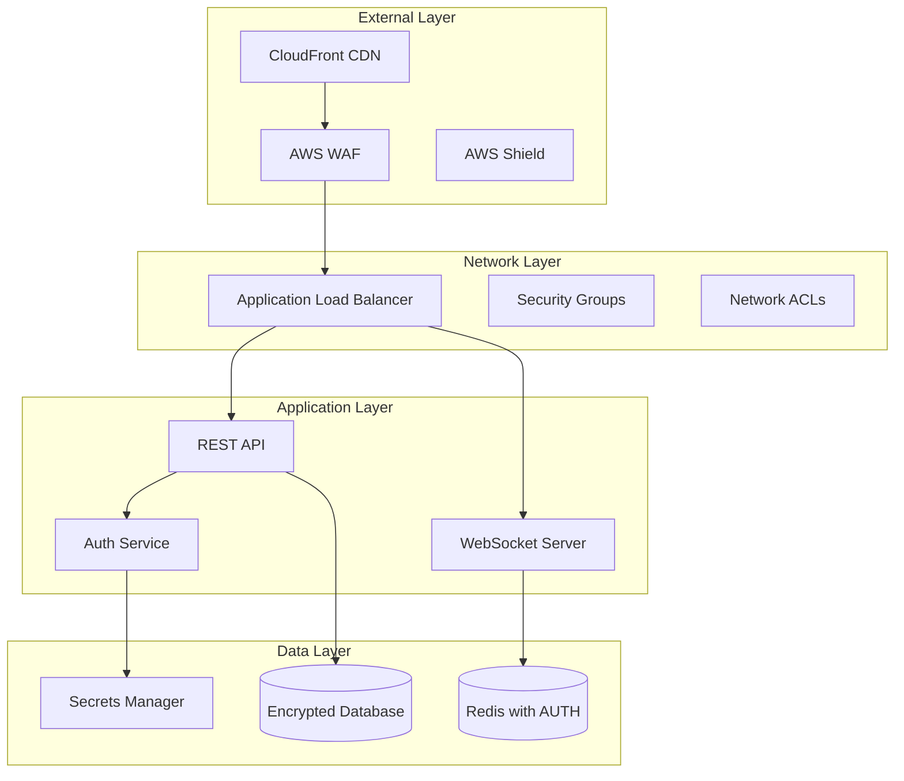

# Security and Compliance Document
## Real-Time Multiplayer Grid Game

### Version: 1.0
### Date: January 2025
### Classification: Internal

---

## Table of Contents
1. [Executive Summary](#executive-summary)
2. [Security Architecture](#security-architecture)
3. [Authentication & Authorization](#authentication--authorization)
4. [Data Protection](#data-protection)
5. [Network Security](#network-security)
6. [Application Security](#application-security)
7. [Compliance Requirements](#compliance-requirements)
8. [Incident Response](#incident-response)
9. [Security Monitoring](#security-monitoring)
10. [Security Checklist](#security-checklist)

---

## Executive Summary

This document outlines the security measures and compliance requirements for the real-time multiplayer grid game. The application handles user data, real-time communications, and game state management, requiring comprehensive security controls.

### Security Objectives
- **Confidentiality**: Protect user data and game information
- **Integrity**: Ensure game state and user actions are not tampered
- **Availability**: Maintain 99.9% uptime with DDoS protection
- **Compliance**: GDPR, CCPA, and SOC 2 Type II compliance

### Risk Assessment Summary
| Risk Category | Level | Mitigation Strategy |
|--------------|-------|-------------------|
| Data Breach | High | Encryption, access controls, monitoring |
| DDoS Attacks | Medium | Rate limiting, CDN, auto-scaling |
| Account Takeover | Medium | OAuth 2.0, session management |
| Game Manipulation | Low | Server-side validation, distributed locks |

---

## Security Architecture

### Defense in Depth Model



### Security Zones

```yaml
SecurityZones:
  Public:
    - CloudFront CDN
    - Public ALB endpoints
    Security: WAF rules, DDoS protection
    
  DMZ:
    - Application servers
    - WebSocket servers
    Security: Restricted ingress, egress filtering
    
  Private:
    - Database servers
    - Redis clusters
    - Internal services
    Security: No internet access, VPC endpoints only
    
  Management:
    - Bastion hosts
    - Admin interfaces
    Security: MFA required, IP whitelisting, audit logging
```

---

## Authentication & Authorization

### OAuth 2.0 Implementation

```typescript
// OAuth configuration with security best practices
export const oauthConfig = {
  google: {
    clientID: process.env.GOOGLE_CLIENT_ID,
    clientSecret: process.env.GOOGLE_CLIENT_SECRET,
    callbackURL: process.env.GOOGLE_CALLBACK_URL,
    scope: ['profile', 'email'],
    // Security configurations
    state: true, // CSRF protection
    pkce: true,  // PKCE for additional security
    prompt: 'select_account', // Force account selection
  }
};

// Secure session configuration
export const sessionConfig = {
  secret: process.env.SESSION_SECRET,
  resave: false,
  saveUninitialized: false,
  cookie: {
    secure: true, // HTTPS only
    httpOnly: true, // No JS access
    sameSite: 'strict', // CSRF protection
    maxAge: 24 * 60 * 60 * 1000, // 24 hours
  },
  store: new RedisStore({
    client: redisClient,
    prefix: 'session:',
    ttl: 86400,
  }),
};
```

### JWT Security

```typescript
// JWT implementation with security headers
import jwt from 'jsonwebtoken';
import { JWK, JWE } from 'node-jose';

export class SecureJWT {
  private readonly keyStore: JWK.KeyStore;
  
  constructor() {
    this.keyStore = JWK.createKeyStore();
  }
  
  async generateToken(payload: any): Promise<string> {
    const token = jwt.sign(payload, process.env.JWT_SECRET!, {
      algorithm: 'RS256',
      expiresIn: '1h',
      issuer: 'gridgame.com',
      audience: 'gridgame-api',
      jwtid: crypto.randomUUID(),
    });
    
    // Additional encryption layer for sensitive data
    if (payload.sensitive) {
      return await this.encryptToken(token);
    }
    
    return token;
  }
  
  async verifyToken(token: string): Promise<any> {
    try {
      // Decrypt if needed
      if (token.startsWith('ey')) {
        token = await this.decryptToken(token);
      }
      
      return jwt.verify(token, process.env.JWT_PUBLIC_KEY!, {
        algorithms: ['RS256'],
        issuer: 'gridgame.com',
        audience: 'gridgame-api',
        clockTolerance: 30, // 30 seconds clock skew tolerance
      });
    } catch (error) {
      throw new UnauthorizedError('Invalid token');
    }
  }
  
  private async encryptToken(token: string): Promise<string> {
    const key = await this.keyStore.get(process.env.JWE_KEY_ID!);
    return await JWE.createEncrypt({ format: 'compact' }, key)
      .update(token)
      .final();
  }
}
```

### Authorization Model

```typescript
// Role-Based Access Control (RBAC)
export enum Role {
  PLAYER = 'player',
  MODERATOR = 'moderator',
  ADMIN = 'admin',
}

export enum Permission {
  // Game permissions
  CREATE_GAME = 'game:create',
  JOIN_GAME = 'game:join',
  DELETE_GAME = 'game:delete',
  
  // User permissions
  VIEW_PROFILE = 'user:view',
  EDIT_PROFILE = 'user:edit',
  BAN_USER = 'user:ban',
  
  // Admin permissions
  VIEW_ANALYTICS = 'analytics:view',
  MANAGE_SYSTEM = 'system:manage',
}

// Permission mapping
const rolePermissions: Record<Role, Permission[]> = {
  [Role.PLAYER]: [
    Permission.CREATE_GAME,
    Permission.JOIN_GAME,
    Permission.VIEW_PROFILE,
    Permission.EDIT_PROFILE,
  ],
  [Role.MODERATOR]: [
    ...rolePermissions[Role.PLAYER],
    Permission.DELETE_GAME,
    Permission.BAN_USER,
  ],
  [Role.ADMIN]: [
    ...rolePermissions[Role.MODERATOR],
    Permission.VIEW_ANALYTICS,
    Permission.MANAGE_SYSTEM,
  ],
};

// Authorization middleware
export const authorize = (requiredPermission: Permission) => {
  return async (req: Request, res: Response, next: NextFunction) => {
    const user = req.user;
    const userPermissions = rolePermissions[user.role] || [];
    
    if (!userPermissions.includes(requiredPermission)) {
      return res.status(403).json({
        error: {
          code: 'FORBIDDEN',
          message: 'Insufficient permissions',
        },
      });
    }
    
    // Log authorization check
    await auditLog.record({
      userId: user.id,
      action: 'authorization_check',
      resource: req.path,
      permission: requiredPermission,
      result: 'granted',
    });
    
    next();
  };
};
```

---

## Data Protection

### Encryption at Rest

```yaml
# Database encryption
PostgreSQL:
  Encryption:
    Type: AES-256
    Implementation: AWS RDS encryption
    KeyManagement: AWS KMS
    KeyRotation: Annual
    
  Backup Encryption:
    Enabled: true
    KeyAlias: alias/rds-backup-key
    
# File storage encryption
S3:
  Encryption:
    Type: SSE-S3
    BucketPolicy:
      RequireEncryption: true
      DenyUnencryptedUploads: true
```

### Encryption in Transit

```typescript
// TLS configuration for all services
export const tlsConfig = {
  // Minimum TLS version
  minVersion: 'TLSv1.3',
  
  // Strong cipher suites only
  ciphers: [
    'ECDHE-RSA-AES128-GCM-SHA256',
    'ECDHE-RSA-AES256-GCM-SHA384',
    'ECDHE-RSA-CHACHA20-POLY1305',
  ].join(':'),
  
  // Certificate configuration
  cert: fs.readFileSync('/certs/server.crt'),
  key: fs.readFileSync('/certs/server.key'),
  ca: fs.readFileSync('/certs/ca.crt'),
  
  // Additional security
  honorCipherOrder: true,
  rejectUnauthorized: true,
};

// HTTPS server
const server = https.createServer(tlsConfig, app);

// WebSocket with TLS
const io = new Server(server, {
  transports: ['websocket'],
  secure: true,
});
```

### Data Classification and Handling

```typescript
// Data classification system
export enum DataClassification {
  PUBLIC = 'public',        // Game names, public profiles
  INTERNAL = 'internal',    // Game statistics, leaderboards
  CONFIDENTIAL = 'confidential', // User emails, private games
  RESTRICTED = 'restricted', // Payment info, auth tokens
}

// Data handling policies
export const dataHandlingPolicies = {
  [DataClassification.PUBLIC]: {
    encryption: false,
    logging: true,
    retention: '1 year',
    access: 'unrestricted',
  },
  [DataClassification.INTERNAL]: {
    encryption: false,
    logging: true,
    retention: '6 months',
    access: 'authenticated users',
  },
  [DataClassification.CONFIDENTIAL]: {
    encryption: true,
    logging: 'masked',
    retention: '90 days',
    access: 'authorized users',
  },
  [DataClassification.RESTRICTED]: {
    encryption: true,
    logging: false,
    retention: '30 days',
    access: 'privileged users',
  },
};

// Field-level encryption for sensitive data
export class FieldEncryption {
  private cipher: Cipher;
  
  async encryptField(value: string, classification: DataClassification): Promise<string> {
    if (classification === DataClassification.RESTRICTED) {
      return await this.encryptWithHSM(value);
    }
    
    if (classification === DataClassification.CONFIDENTIAL) {
      return this.cipher.encrypt(value);
    }
    
    return value;
  }
  
  private async encryptWithHSM(value: string): Promise<string> {
    // Hardware Security Module encryption for highest sensitivity
    const hsm = await connectToHSM();
    return await hsm.encrypt(value, { algorithm: 'AES-GCM-256' });
  }
}
```

### Personal Data Protection

```typescript
// GDPR compliance implementation
export class PersonalDataProtection {
  // Data minimization
  async collectUserData(oauthData: any): Promise<User> {
    return {
      id: generateUUID(),
      googleId: hash(oauthData.id), // Hash external IDs
      email: oauthData.email,
      name: oauthData.name,
      // Don't store unnecessary data
      createdAt: new Date(),
    };
  }
  
  // Right to erasure (GDPR Article 17)
  async deleteUserData(userId: string): Promise<void> {
    await db.transaction(async (trx) => {
      // Anonymize game history
      await trx('moves')
        .where('user_id', userId)
        .update({ user_id: 'DELETED_USER' });
      
      // Delete personal data
      await trx('users').where('id', userId).delete();
      
      // Clear cache
      await redis.del(`user:${userId}:*`);
      
      // Log deletion
      await auditLog.record({
        action: 'user_data_deletion',
        userId,
        timestamp: new Date(),
        reason: 'user_request',
      });
    });
  }
  
  // Data portability (GDPR Article 20)
  async exportUserData(userId: string): Promise<object> {
    const userData = await db('users').where('id', userId).first();
    const gameHistory = await db('games')
      .join('game_participants', 'games.id', 'game_participants.game_id')
      .where('game_participants.user_id', userId)
      .select('games.*');
    
    return {
      personalData: userData,
      gameHistory: gameHistory,
      exportDate: new Date(),
      format: 'JSON',
    };
  }
}
```

---

## Network Security

### Firewall Rules

```yaml
# AWS Security Groups
SecurityGroups:
  ALB:
    Ingress:
      - Protocol: HTTPS
        Port: 443
        Source: 0.0.0.0/0
      - Protocol: HTTP
        Port: 80
        Source: 0.0.0.0/0  # Redirect to HTTPS
    Egress:
      - Protocol: TCP
        Port: 3000
        Destination: AppServerSG
      - Protocol: TCP
        Port: 3001
        Destination: WebSocketSG
        
  AppServer:
    Ingress:
      - Protocol: TCP
        Port: 3000
        Source: ALBSG
    Egress:
      - Protocol: TCP
        Port: 5432
        Destination: DatabaseSG
      - Protocol: TCP
        Port: 6379
        Destination: RedisSG
      - Protocol: HTTPS
        Port: 443
        Destination: 0.0.0.0/0  # External APIs
        
  Database:
    Ingress:
      - Protocol: TCP
        Port: 5432
        Source: AppServerSG
    Egress: []  # No outbound connections
    
  Redis:
    Ingress:
      - Protocol: TCP
        Port: 6379
        Source: AppServerSG
      - Protocol: TCP
        Port: 6379
        Source: WebSocketSG
    Egress: []
```

### DDoS Protection

```typescript
// Rate limiting configuration
import rateLimit from 'express-rate-limit';
import RedisStore from 'rate-limit-redis';

// Different rate limits for different endpoints
export const rateLimiters = {
  // Strict limit for authentication
  auth: rateLimit({
    store: new RedisStore({ client: redis }),
    windowMs: 15 * 60 * 1000, // 15 minutes
    max: 5, // 5 requests per window
    message: 'Too many authentication attempts',
    standardHeaders: true,
    legacyHeaders: false,
  }),
  
  // Standard API limit
  api: rateLimit({
    store: new RedisStore({ client: redis }),
    windowMs: 1 * 60 * 1000, // 1 minute
    max: 100, // 100 requests per minute
    skip: (req) => req.user?.role === Role.ADMIN,
  }),
  
  // WebSocket connection limit
  websocket: rateLimit({
    store: new RedisStore({ client: redis }),
    windowMs: 1 * 60 * 1000,
    max: 10, // 10 new connections per minute
    keyGenerator: (req) => req.ip,
  }),
  
  // Game action limit
  gameAction: rateLimit({
    store: new RedisStore({ client: redis }),
    windowMs: 1000, // 1 second
    max: 10, // 10 actions per second
    keyGenerator: (req) => req.user.id,
  }),
};

// Advanced DDoS protection
export class DDoSProtection {
  private blacklist: Set<string> = new Set();
  private suspicious: Map<string, number> = new Map();
  
  async checkRequest(req: Request): Promise<boolean> {
    const ip = req.ip;
    
    // Check blacklist
    if (this.blacklist.has(ip)) {
      return false;
    }
    
    // Pattern detection
    const suspiciousScore = await this.calculateSuspiciousScore(req);
    if (suspiciousScore > 100) {
      this.blacklist.add(ip);
      await this.notifySecurityTeam(ip, 'Automated DDoS detection');
      return false;
    }
    
    return true;
  }
  
  private async calculateSuspiciousScore(req: Request): Promise<number> {
    let score = 0;
    
    // Rapid sequential requests
    const recentRequests = await redis.incr(`req:${req.ip}:${Date.now() / 1000 | 0}`);
    if (recentRequests > 50) score += 50;
    
    // No user agent
    if (!req.headers['user-agent']) score += 30;
    
    // Suspicious patterns
    if (req.path.includes('..') || req.path.includes('%')) score += 40;
    
    return score;
  }
}
```

### WAF Rules

```json
{
  "Rules": [
    {
      "Name": "SQLiProtection",
      "Priority": 1,
      "Statement": {
        "ManagedRuleGroupStatement": {
          "VendorName": "AWS",
          "Name": "AWSManagedRulesSQLiRuleSet"
        }
      },
      "Action": { "Block": {} }
    },
    {
      "Name": "XSSProtection",
      "Priority": 2,
      "Statement": {
        "ManagedRuleGroupStatement": {
          "VendorName": "AWS",
          "Name": "AWSManagedRulesKnownBadInputsRuleSet"
        }
      },
      "Action": { "Block": {} }
    },
    {
      "Name": "RateLimitProtection",
      "Priority": 3,
      "Statement": {
        "RateBasedStatement": {
          "Limit": 1000,
          "AggregateKeyType": "IP"
        }
      },
      "Action": { "Block": {} }
    },
    {
      "Name": "GeoBlocking",
      "Priority": 4,
      "Statement": {
        "GeoMatchStatement": {
          "CountryCodes": ["CN", "RU", "KP"]
        }
      },
      "Action": { "Block": {} }
    }
  ]
}
```

---

## Application Security

### Input Validation

```typescript
// Comprehensive input validation
import { body, param, query, validationResult } from 'express-validator';
import DOMPurify from 'isomorphic-dompurify';

export const validators = {
  createGame: [
    body('boardSize')
      .isInt({ min: 4, max: 16 })
      .withMessage('Board size must be between 4 and 16'),
    body('name')
      .trim()
      .isLength({ min: 3, max: 50 })
      .matches(/^[a-zA-Z0-9\s'-]+$/)
      .withMessage('Invalid game name')
      .customSanitizer(value => DOMPurify.sanitize(value)),
  ],
  
  gameMove: [
    param('gameId')
      .matches(/^game_[a-zA-Z0-9]{9}$/)
      .withMessage('Invalid game ID'),
    body('x')
      .isInt({ min: 0, max: 15 })
      .withMessage('Invalid X coordinate'),
    body('y')
      .isInt({ min: 0, max: 15 })
      .withMessage('Invalid Y coordinate'),
  ],
  
  userSearch: [
    query('q')
      .trim()
      .escape()
      .isLength({ min: 2, max: 50 })
      .matches(/^[a-zA-Z0-9@.\s-]+$/)
      .withMessage('Invalid search query'),
  ],
};

// SQL injection prevention
export class SafeQuery {
  static async findUser(email: string): Promise<User | null> {
    // Use parameterized queries
    const result = await db.query(
      'SELECT * FROM users WHERE email = $1',
      [email]
    );
    return result.rows[0] || null;
  }
  
  static async searchGames(term: string): Promise<Game[]> {
    // Validate and sanitize
    const safeTerm = term.replace(/[%_]/g, '\\$&');
    
    return await db('games')
      .where('name', 'ilike', `%${safeTerm}%`)
      .andWhere('status', 'waiting')
      .limit(20);
  }
}
```

### Secure Headers

```typescript
// Security headers middleware
import helmet from 'helmet';

export const securityHeaders = helmet({
  contentSecurityPolicy: {
    directives: {
      defaultSrc: ["'self'"],
      scriptSrc: ["'self'", "'unsafe-inline'", 'https://apis.google.com'],
      styleSrc: ["'self'", "'unsafe-inline'", 'https://fonts.googleapis.com'],
      fontSrc: ["'self'", 'https://fonts.gstatic.com'],
      imgSrc: ["'self'", 'data:', 'https:'],
      connectSrc: ["'self'", 'wss://*.gridgame.com'],
      frameAncestors: ["'none'"],
      formAction: ["'self'"],
      upgradeInsecureRequests: [],
    },
  },
  hsts: {
    maxAge: 31536000,
    includeSubDomains: true,
    preload: true,
  },
  referrerPolicy: { policy: 'strict-origin-when-cross-origin' },
  permittedCrossDomainPolicies: false,
});

// Additional custom headers
app.use((req, res, next) => {
  res.setHeader('X-Content-Type-Options', 'nosniff');
  res.setHeader('X-Frame-Options', 'DENY');
  res.setHeader('X-XSS-Protection', '1; mode=block');
  res.setHeader('Strict-Transport-Security', 'max-age=31536000');
  res.setHeader('Permissions-Policy', 'geolocation=(), microphone=(), camera=()');
  next();
});
```

### Dependency Security

```yaml
# Package security scanning
DependencyScanning:
  Tools:
    - npm audit
    - Snyk
    - WhiteSource
    
  Schedule:
    Daily: Vulnerability scan
    Weekly: License compliance check
    Monthly: Full dependency review
    
  Policies:
    Critical: Block deployment
    High: Require approval
    Medium: Warning notification
    Low: Log for review
```

```json
// package.json security scripts
{
  "scripts": {
    "security:check": "npm audit --production",
    "security:fix": "npm audit fix --force",
    "security:snyk": "snyk test",
    "security:licenses": "license-checker --production --summary",
    "preinstall": "npm run security:check"
  },
  "husky": {
    "hooks": {
      "pre-commit": "npm run security:check"
    }
  }
}
```

---

## Compliance Requirements

### GDPR Compliance

```typescript
// GDPR compliance implementation
export class GDPRCompliance {
  // Privacy by Design
  async createUser(data: any): Promise<User> {
    return {
      id: generateUUID(),
      email: data.email, // Required for service
      name: data.name || 'Anonymous', // Optional
      marketingConsent: false, // Opt-in by default
      dataProcessingConsent: true, // Required for service
      consentTimestamp: new Date(),
    };
  }
  
  // Consent management
  async updateConsent(userId: string, consents: ConsentUpdate): Promise<void> {
    await db('user_consents').insert({
      userId,
      ...consents,
      ipAddress: hashIP(req.ip),
      timestamp: new Date(),
    });
  }
  
  // Data retention
  async enforceDataRetention(): Promise<void> {
    // Delete inactive users after 2 years
    const cutoffDate = new Date();
    cutoffDate.setFullYear(cutoffDate.getFullYear() - 2);
    
    const inactiveUsers = await db('users')
      .where('last_active', '<', cutoffDate)
      .select('id');
    
    for (const user of inactiveUsers) {
      await this.deleteUserData(user.id);
    }
  }
  
  // Cookie consent
  configureCookieConsent(): void {
    app.use(cookieConsent({
      categories: {
        necessary: {
          enabled: true,
          readOnly: true,
        },
        analytics: {
          enabled: false,
        },
        marketing: {
          enabled: false,
        },
      },
    }));
  }
}
```

### SOC 2 Controls

```yaml
# SOC 2 Type II Controls
ControlObjectives:
  Security:
    CC1.1: Control environment
    CC1.2: Communication and information
    CC1.3: Risk assessment
    CC1.4: Monitoring activities
    CC1.5: Control activities
    
  Availability:
    A1.1: System availability
    A1.2: Environmental protections
    A1.3: Recovery capabilities
    
  ProcessingIntegrity:
    PI1.1: System processing
    PI1.2: Data validation
    PI1.3: Error handling
    
  Confidentiality:
    C1.1: Data classification
    C1.2: Data protection
    C1.3: Data disposal
    
  Privacy:
    P1.1: Notice and consent
    P1.2: Choice and consent
    P1.3: Collection and use
    P1.4: Access
    P1.5: Disclosure to third parties
    P1.6: Security for privacy
    P1.7: Quality
    P1.8: Monitoring and enforcement
```

### Compliance Monitoring

```typescript
// Automated compliance monitoring
export class ComplianceMonitor {
  async runDailyChecks(): Promise<ComplianceReport> {
    const report: ComplianceReport = {
      date: new Date(),
      checks: [],
    };
    
    // Check data encryption
    report.checks.push(await this.checkEncryption());
    
    // Check access logs
    report.checks.push(await this.checkAccessLogs());
    
    // Check data retention
    report.checks.push(await this.checkDataRetention());
    
    // Check security patches
    report.checks.push(await this.checkSecurityPatches());
    
    // Generate report
    if (report.checks.some(c => c.status === 'failed')) {
      await this.alertComplianceTeam(report);
    }
    
    return report;
  }
  
  private async checkEncryption(): Promise<ComplianceCheck> {
    const unencryptedData = await db('users')
      .whereRaw("email NOT LIKE 'encrypted:%'")
      .count();
    
    return {
      name: 'Data Encryption',
      status: unencryptedData[0].count === 0 ? 'passed' : 'failed',
      details: `Found ${unencryptedData[0].count} unencrypted records`,
    };
  }
}
```

---

## Incident Response

### Incident Response Plan

```yaml
IncidentResponsePlan:
  Phases:
    1_Preparation:
      - Incident response team contacts
      - Communication templates
      - Response tooling ready
      - Regular drills
      
    2_Detection:
      - Automated alerting
      - 24/7 monitoring
      - Threat intelligence feeds
      - User reports
      
    3_Containment:
      - Isolate affected systems
      - Preserve evidence
      - Prevent spread
      - Maintain operations
      
    4_Eradication:
      - Remove threat
      - Patch vulnerabilities
      - Update defenses
      - Verify clean systems
      
    5_Recovery:
      - Restore services
      - Monitor for recurrence
      - Validate operations
      - Update documentation
      
    6_PostIncident:
      - Lessons learned
      - Update procedures
      - Stakeholder communication
      - Compliance reporting
```

### Security Incident Handling

```typescript
// Incident response system
export class IncidentResponse {
  async handleSecurityIncident(incident: SecurityIncident): Promise<void> {
    // 1. Log incident
    const incidentId = await this.logIncident(incident);
    
    // 2. Assess severity
    const severity = this.assessSeverity(incident);
    
    // 3. Immediate containment
    if (severity === 'critical') {
      await this.containIncident(incident);
    }
    
    // 4. Notify stakeholders
    await this.notifyStakeholders(incident, severity);
    
    // 5. Collect evidence
    await this.collectEvidence(incidentId);
    
    // 6. Begin remediation
    await this.startRemediation(incident);
  }
  
  private async containIncident(incident: SecurityIncident): Promise<void> {
    switch (incident.type) {
      case 'data_breach':
        // Revoke affected access tokens
        await this.revokeTokens(incident.affectedUsers);
        // Force password resets
        await this.forcePasswordResets(incident.affectedUsers);
        break;
        
      case 'ddos_attack':
        // Enable emergency rate limiting
        await this.enableEmergencyRateLimits();
        // Block suspicious IPs
        await this.blockSuspiciousIPs(incident.sourceIPs);
        break;
        
      case 'account_takeover':
        // Lock affected accounts
        await this.lockAccounts(incident.affectedUsers);
        // Invalidate all sessions
        await this.invalidateSessions(incident.affectedUsers);
        break;
    }
  }
  
  private async collectEvidence(incidentId: string): Promise<void> {
    // Create evidence package
    const evidence = {
      logs: await this.collectLogs(incidentId),
      metrics: await this.collectMetrics(incidentId),
      snapshots: await this.createSystemSnapshots(),
      timestamp: new Date(),
    };
    
    // Store securely
    await this.storeEvidence(incidentId, evidence);
  }
}
```

### Breach Notification

```typescript
// Data breach notification system
export class BreachNotification {
  async notifyDataBreach(breach: DataBreach): Promise<void> {
    // Assess notification requirements
    const requirements = this.assessNotificationRequirements(breach);
    
    // Notify authorities (GDPR 72-hour requirement)
    if (requirements.notifyAuthorities) {
      await this.notifyDataProtectionAuthority(breach);
    }
    
    // Notify affected users
    if (requirements.notifyUsers) {
      await this.notifyAffectedUsers(breach);
    }
    
    // Public disclosure if required
    if (requirements.publicDisclosure) {
      await this.publishSecurityAdvisory(breach);
    }
  }
  
  private assessNotificationRequirements(breach: DataBreach): NotificationRequirements {
    return {
      notifyAuthorities: breach.affectedUsers > 0 && breach.includesPersonalData,
      notifyUsers: breach.riskLevel === 'high' && breach.includesPersonalData,
      publicDisclosure: breach.affectedUsers > 1000 || breach.riskLevel === 'critical',
      timeline: breach.includesEUData ? 72 : 168, // hours
    };
  }
  
  private async notifyAffectedUsers(breach: DataBreach): Promise<void> {
    const template = `
      Dear User,
      
      We are writing to inform you of a security incident that may have affected your account.
      
      What happened: ${breach.description}
      When: ${breach.discoveredAt}
      What information was involved: ${breach.dataTypes.join(', ')}
      
      What we're doing: ${breach.remediation}
      
      What you should do:
      1. Change your password immediately
      2. Enable two-factor authentication
      3. Monitor your account for suspicious activity
      
      We sincerely apologize for any inconvenience.
      
      The GridGame Security Team
    `;
    
    for (const userId of breach.affectedUsers) {
      await this.sendSecureEmail(userId, 'Important Security Update', template);
    }
  }
}
```

---

## Security Monitoring

### Logging and Monitoring

```typescript
// Centralized security logging
export class SecurityLogger {
  private readonly logger: Winston.Logger;
  
  constructor() {
    this.logger = winston.createLogger({
      level: 'info',
      format: winston.format.json(),
      defaultMeta: { service: 'gridgame' },
      transports: [
        // Security events to separate file
        new winston.transports.File({
          filename: 'security.log',
          level: 'warning',
        }),
        // All logs to CloudWatch
        new CloudWatchTransport({
          logGroupName: '/aws/gridgame/security',
          logStreamName: `security-${process.env.NODE_ENV}`,
        }),
        // Critical alerts to Slack
        new SlackTransport({
          webhookUrl: process.env.SLACK_SECURITY_WEBHOOK,
          level: 'error',
        }),
      ],
    });
  }
  
  async logSecurityEvent(event: SecurityEvent): Promise<void> {
    const enrichedEvent = {
      ...event,
      timestamp: new Date().toISOString(),
      environment: process.env.NODE_ENV,
      serverIp: await this.getServerIP(),
      metadata: await this.enrichMetadata(event),
    };
    
    this.logger.log(event.severity, event.message, enrichedEvent);
    
    // Real-time alerting for critical events
    if (event.severity === 'critical') {
      await this.sendAlert(enrichedEvent);
    }
  }
}

// Security metrics collection
export class SecurityMetrics {
  private readonly metrics: Map<string, Metric> = new Map();
  
  constructor() {
    // Initialize security metrics
    this.metrics.set('failed_logins', new Counter({
      name: 'security_failed_logins_total',
      help: 'Total number of failed login attempts',
      labelNames: ['method', 'ip_range'],
    }));
    
    this.metrics.set('suspicious_requests', new Counter({
      name: 'security_suspicious_requests_total',
      help: 'Total number of suspicious requests blocked',
      labelNames: ['type', 'action'],
    }));
    
    this.metrics.set('auth_latency', new Histogram({
      name: 'security_auth_duration_seconds',
      help: 'Authentication request duration',
      buckets: [0.1, 0.5, 1, 2, 5],
    }));
  }
  
  recordFailedLogin(method: string, ip: string): void {
    const ipRange = this.getIPRange(ip);
    this.metrics.get('failed_logins').inc({ method, ip_range: ipRange });
  }
}
```

### SIEM Integration

```yaml
# SIEM Configuration
SIEM:
  Platform: Splunk
  DataSources:
    - Application logs
    - AWS CloudTrail
    - VPC Flow Logs
    - WAF logs
    - Database audit logs
    
  Alerts:
    - Name: "Multiple Failed Logins"
      Query: "failed_login_count > 5 within 5 minutes"
      Severity: High
      
    - Name: "Suspicious Database Queries"
      Query: "query contains 'DROP' OR 'TRUNCATE'"
      Severity: Critical
      
    - Name: "Unusual Data Access"
      Query: "data_accessed > avg_daily * 3"
      Severity: Medium
      
    - Name: "Privilege Escalation"
      Query: "role_changed to 'admin'"
      Severity: Critical
```

### Security Dashboard

```typescript
// Real-time security dashboard
export class SecurityDashboard {
  async getSecurityMetrics(): Promise<DashboardMetrics> {
    return {
      threats: {
        blocked_ips: await redis.scard('security:blocked_ips'),
        failed_logins: await this.getFailedLoginCount(24),
        suspicious_activities: await this.getSuspiciousActivityCount(24),
      },
      compliance: {
        encryption_coverage: await this.getEncryptionCoverage(),
        patch_compliance: await this.getPatchCompliance(),
        audit_status: await this.getAuditStatus(),
      },
      incidents: {
        open: await this.getOpenIncidents(),
        resolved_24h: await this.getResolvedIncidents(24),
        mean_time_to_resolve: await this.getMTTR(),
      },
      health: {
        ssl_expiry: await this.getSSLExpiry(),
        key_rotation_status: await this.getKeyRotationStatus(),
        backup_status: await this.getBackupStatus(),
      },
    };
  }
}
```

---

## Security Checklist

### Pre-Deployment Security Checklist

```yaml
PreDeploymentChecklist:
  CodeSecurity:
    - [ ] SAST scan completed (SonarQube)
    - [ ] DAST scan completed (OWASP ZAP)
    - [ ] Dependency vulnerabilities resolved
    - [ ] Code review completed
    - [ ] Security unit tests passing
    
  Infrastructure:
    - [ ] TLS certificates valid
    - [ ] Security groups configured
    - [ ] WAF rules enabled
    - [ ] Secrets rotated
    - [ ] Backup tested
    
  Authentication:
    - [ ] OAuth properly configured
    - [ ] Session management secure
    - [ ] MFA available
    - [ ] Password policy enforced
    
  DataProtection:
    - [ ] Encryption at rest enabled
    - [ ] Encryption in transit configured
    - [ ] PII properly handled
    - [ ] Data retention configured
    
  Monitoring:
    - [ ] Security logging enabled
    - [ ] Alerts configured
    - [ ] SIEM integrated
    - [ ] Incident response tested
```

### Operational Security Checklist

```yaml
OperationalChecklist:
  Daily:
    - [ ] Review security alerts
    - [ ] Check failed login attempts
    - [ ] Verify backup completion
    - [ ] Review system health
    
  Weekly:
    - [ ] Review access logs
    - [ ] Check patch status
    - [ ] Verify compliance metrics
    - [ ] Test incident response
    
  Monthly:
    - [ ] Rotate secrets
    - [ ] Review user permissions
    - [ ] Security training
    - [ ] Penetration testing
    
  Quarterly:
    - [ ] Full security audit
    - [ ] Compliance review
    - [ ] Disaster recovery drill
    - [ ] Policy updates
```

### Security Training Requirements

```yaml
SecurityTraining:
  Developers:
    Required:
      - OWASP Top 10
      - Secure coding practices
      - Git security
      - Secret management
    Frequency: Annual
    
  Operations:
    Required:
      - Incident response
      - Security monitoring
      - Compliance requirements
      - Data handling
    Frequency: Semi-annual
    
  AllStaff:
    Required:
      - Security awareness
      - Phishing detection
      - Data protection
      - Password security
    Frequency: Quarterly
```

This comprehensive security and compliance document provides a robust framework for protecting the real-time multiplayer grid game and its users' data while ensuring compliance with relevant regulations.