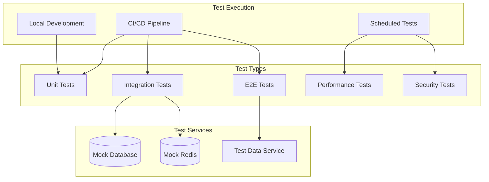

# Testing Strategy Document
## Real-Time Multiplayer Grid Game

### Version: 1.0
### Date: January 2025

---

## Table of Contents
1. [Overview](#overview)
2. [Testing Principles](#testing-principles)
3. [Test Architecture](#test-architecture)
4. [Unit Testing](#unit-testing)
5. [Integration Testing](#integration-testing)
6. [End-to-End Testing](#end-to-end-testing)
7. [Performance Testing](#performance-testing)
8. [Security Testing](#security-testing)
9. [Test Data Management](#test-data-management)
10. [Continuous Testing](#continuous-testing)

---

## Overview

This document outlines the comprehensive testing strategy for the real-time multiplayer grid game. The strategy ensures system reliability, performance, and security through multiple layers of testing.

### Testing Goals
- **Code Coverage**: Minimum 80% for critical paths
- **Performance**: Sub-100ms response times
- **Reliability**: 99.9% uptime
- **Security**: OWASP Top 10 compliance
- **User Experience**: Smooth gameplay across devices

### Testing Stack
- **Unit Tests**: Jest, React Testing Library
- **Integration Tests**: Supertest, Socket.io Client
- **E2E Tests**: Cypress, Playwright
- **Performance Tests**: K6, Artillery
- **Security Tests**: OWASP ZAP, Snyk

---

## Testing Principles

### Testing Pyramid

```
         /\
        /E2E\         (10%)
       /------\
      /  INT   \      (20%)
     /----------\
    /    UNIT    \    (70%)
   /--------------\
```

### Key Principles
1. **Test Early and Often**: Shift-left approach
2. **Automate Everything**: CI/CD integration
3. **Test in Production**: Synthetic monitoring
4. **Data-Driven Testing**: Realistic test scenarios
5. **Risk-Based Testing**: Focus on critical paths

---

## Test Architecture

### Test Environment Strategy

```yaml
Environments:
  Local:
    - Unit tests
    - Component tests
    - Mock external services
    
  CI/CD:
    - All automated tests
    - Parallel execution
    - Test result reporting
    
  Staging:
    - Integration tests
    - E2E tests
    - Performance tests
    
  Production:
    - Smoke tests
    - Synthetic monitoring
    - Chaos testing
```

### Test Infrastructure



---

## Unit Testing

### Backend Unit Tests

#### **Test Structure**
```typescript
// user.service.test.ts
import { UserService } from '../src/services/user.service';
import { UserRepository } from '../src/repositories/user.repository';
import { createMockUser } from './factories/user.factory';

jest.mock('../src/repositories/user.repository');

describe('UserService', () => {
  let userService: UserService;
  let mockRepository: jest.Mocked<UserRepository>;

  beforeEach(() => {
    mockRepository = new UserRepository() as jest.Mocked<UserRepository>;
    userService = new UserService(mockRepository);
    jest.clearAllMocks();
  });

  describe('createUser', () => {
    it('should create a new user with valid data', async () => {
      const userData = {
        googleId: 'google123',
        email: 'test@example.com',
        name: 'Test User'
      };
      const mockUser = createMockUser(userData);
      
      mockRepository.create.mockResolvedValue(mockUser);

      const result = await userService.createUser(userData);

      expect(mockRepository.create).toHaveBeenCalledWith(userData);
      expect(result).toEqual(mockUser);
    });

    it('should throw error for duplicate email', async () => {
      mockRepository.create.mockRejectedValue(
        new Error('Unique constraint violation')
      );

      await expect(userService.createUser({
        googleId: 'google123',
        email: 'existing@example.com',
        name: 'Test User'
      })).rejects.toThrow('User already exists');
    });
  });
});
```

#### **Game Logic Tests**
```typescript
// game.engine.test.ts
import { GameEngine } from '../src/game/engine';
import { CellClaim } from '../src/game/types';

describe('GameEngine', () => {
  let engine: GameEngine;

  beforeEach(() => {
    engine = new GameEngine({ boardSize: 4 });
  });

  describe('claimCell', () => {
    it('should successfully claim empty cell', () => {
      const claim: CellClaim = {
        userId: 'user1',
        x: 0,
        y: 0,
        color: '#FF0000'
      };

      const result = engine.claimCell(claim);

      expect(result.success).toBe(true);
      expect(engine.getCell(0, 0)).toEqual({
        owner: 'user1',
        color: '#FF0000'
      });
    });

    it('should fail to claim occupied cell', () => {
      engine.claimCell({
        userId: 'user1',
        x: 0,
        y: 0,
        color: '#FF0000'
      });

      const result = engine.claimCell({
        userId: 'user2',
        x: 0,
        y: 0,
        color: '#00FF00'
      });

      expect(result.success).toBe(false);
      expect(result.reason).toBe('cell_already_claimed');
    });

    it('should detect game end condition', () => {
      // Fill all cells except one
      for (let x = 0; x < 4; x++) {
        for (let y = 0; y < 4; y++) {
          if (!(x === 3 && y === 3)) {
            engine.claimCell({
              userId: 'user1',
              x,
              y,
              color: '#FF0000'
            });
          }
        }
      }

      expect(engine.isGameOver()).toBe(false);

      // Claim last cell
      engine.claimCell({
        userId: 'user2',
        x: 3,
        y: 3,
        color: '#00FF00'
      });

      expect(engine.isGameOver()).toBe(true);
      expect(engine.getWinner()).toBe('user1');
    });
  });
});
```

### Frontend Unit Tests

#### **Component Tests**
```typescript
// GameBoard.test.tsx
import { render, fireEvent, screen } from '@testing-library/react';
import { GameBoard } from '../src/components/GameBoard';
import { GameContext } from '../src/contexts/GameContext';
import { mockGameState } from './mocks/gameState';

const mockOnCellClick = jest.fn();

const renderWithContext = (gameState = mockGameState) => {
  return render(
    <GameContext.Provider value={{ gameState, onCellClick: mockOnCellClick }}>
      <GameBoard />
    </GameContext.Provider>
  );
};

describe('GameBoard', () => {
  beforeEach(() => {
    jest.clearAllMocks();
  });

  it('should render correct board size', () => {
    renderWithContext({
      ...mockGameState,
      boardSize: 8
    });

    const cells = screen.getAllByTestId(/cell-\d+-\d+/);
    expect(cells).toHaveLength(64);
  });

  it('should handle cell clicks', () => {
    renderWithContext();

    const cell = screen.getByTestId('cell-0-0');
    fireEvent.click(cell);

    expect(mockOnCellClick).toHaveBeenCalledWith(0, 0);
  });

  it('should display claimed cells with correct color', () => {
    renderWithContext({
      ...mockGameState,
      board: [
        ['user1', null],
        [null, 'user2']
      ],
      players: [
        { userId: 'user1', color: '#FF0000' },
        { userId: 'user2', color: '#00FF00' }
      ]
    });

    const cell00 = screen.getByTestId('cell-0-0');
    expect(cell00).toHaveStyle('background-color: #FF0000');

    const cell11 = screen.getByTestId('cell-1-1');
    expect(cell11).toHaveStyle('background-color: #00FF00');
  });

  it('should disable clicks on claimed cells', () => {
    renderWithContext({
      ...mockGameState,
      board: [['user1', null]]
    });

    const claimedCell = screen.getByTestId('cell-0-0');
    fireEvent.click(claimedCell);

    expect(mockOnCellClick).not.toHaveBeenCalled();
  });
});
```

#### **Hook Tests**
```typescript
// useWebSocket.test.ts
import { renderHook, act } from '@testing-library/react-hooks';
import { useWebSocket } from '../src/hooks/useWebSocket';
import { io } from 'socket.io-client';

jest.mock('socket.io-client');
const mockSocket = {
  on: jest.fn(),
  emit: jest.fn(),
  disconnect: jest.fn(),
  connect: jest.fn()
};

(io as jest.Mock).mockReturnValue(mockSocket);

describe('useWebSocket', () => {
  beforeEach(() => {
    jest.clearAllMocks();
  });

  it('should connect on mount', () => {
    const { result } = renderHook(() => useWebSocket('http://localhost:3000'));

    expect(io).toHaveBeenCalledWith('http://localhost:3000', {
      auth: expect.any(Object)
    });
    expect(result.current.connected).toBe(false);
  });

  it('should handle connection events', () => {
    const { result } = renderHook(() => useWebSocket('http://localhost:3000'));

    // Simulate connection
    act(() => {
      const connectHandler = mockSocket.on.mock.calls.find(
        call => call[0] === 'connect'
      )[1];
      connectHandler();
    });

    expect(result.current.connected).toBe(true);
  });

  it('should emit events', () => {
    const { result } = renderHook(() => useWebSocket('http://localhost:3000'));

    act(() => {
      result.current.emit('game:click_cell', { x: 0, y: 0 });
    });

    expect(mockSocket.emit).toHaveBeenCalledWith('game:click_cell', { x: 0, y: 0 });
  });
});
```

---

## Integration Testing

### API Integration Tests

```typescript
// api.integration.test.ts
import request from 'supertest';
import { app } from '../src/app';
import { setupTestDatabase, teardownTestDatabase } from './helpers/database';
import { generateAuthToken } from './helpers/auth';

describe('Game API Integration', () => {
  let authToken: string;
  let testUserId: string;

  beforeAll(async () => {
    await setupTestDatabase();
    const user = await createTestUser();
    testUserId = user.id;
    authToken = generateAuthToken(user);
  });

  afterAll(async () => {
    await teardownTestDatabase();
  });

  describe('POST /api/games', () => {
    it('should create a new game', async () => {
      const response = await request(app)
        .post('/api/games')
        .set('Authorization', `Bearer ${authToken}`)
        .send({
          boardSize: 8,
          name: 'Test Game'
        });

      expect(response.status).toBe(201);
      expect(response.body).toMatchObject({
        id: expect.stringMatching(/^game_/),
        boardSize: 8,
        name: 'Test Game',
        creatorId: testUserId,
        status: 'waiting'
      });
    });

    it('should validate board size', async () => {
      const response = await request(app)
        .post('/api/games')
        .set('Authorization', `Bearer ${authToken}`)
        .send({
          boardSize: 20,
          name: 'Invalid Game'
        });

      expect(response.status).toBe(400);
      expect(response.body.error.message).toContain('Board size must be between 4 and 16');
    });
  });

  describe('Game Flow Integration', () => {
    let gameId: string;
    let player2Token: string;

    beforeEach(async () => {
      const game = await createTestGame(testUserId);
      gameId = game.id;
      
      const player2 = await createTestUser();
      player2Token = generateAuthToken(player2);
    });

    it('should complete full game flow', async () => {
      // Join game
      const joinResponse = await request(app)
        .post(`/api/games/${gameId}/join`)
        .set('Authorization', `Bearer ${player2Token}`)
        .send({ color: '#00FF00' });

      expect(joinResponse.status).toBe(200);

      // Start game
      const startResponse = await request(app)
        .post(`/api/games/${gameId}/start`)
        .set('Authorization', `Bearer ${authToken}`);

      expect(startResponse.status).toBe(200);

      // Get game state
      const stateResponse = await request(app)
        .get(`/api/games/${gameId}`)
        .set('Authorization', `Bearer ${authToken}`);

      expect(stateResponse.body.status).toBe('in_progress');
      expect(stateResponse.body.players).toHaveLength(2);
    });
  });
});
```

### WebSocket Integration Tests

```typescript
// websocket.integration.test.ts
import Client from 'socket.io-client';
import { server } from '../src/server';
import { createTestGame, createTestUser } from './helpers/factories';

describe('WebSocket Integration', () => {
  let clientSocket1: any;
  let clientSocket2: any;
  let serverSocket: any;

  beforeAll((done) => {
    server.listen(() => {
      const port = server.address().port;
      clientSocket1 = new Client(`http://localhost:${port}`);
      clientSocket2 = new Client(`http://localhost:${port}`);
      done();
    });
  });

  afterAll(() => {
    server.close();
    clientSocket1.close();
    clientSocket2.close();
  });

  describe('Real-time Game Updates', () => {
    it('should broadcast cell claims to all players', (done) => {
      const gameId = 'test-game-123';
      let receivedUpdates = 0;

      // Both clients join the game
      clientSocket1.emit('game:join', { gameId });
      clientSocket2.emit('game:join', { gameId });

      // Client 2 listens for updates
      clientSocket2.on('game:cell_claimed', (data) => {
        expect(data).toMatchObject({
          x: 3,
          y: 4,
          userId: expect.any(String),
          color: '#FF0000'
        });
        receivedUpdates++;
        if (receivedUpdates === 1) done();
      });

      // Client 1 claims a cell
      setTimeout(() => {
        clientSocket1.emit('game:click_cell', {
          gameId,
          x: 3,
          y: 4
        });
      }, 100);
    });

    it('should handle concurrent cell claims correctly', (done) => {
      const gameId = 'test-game-456';
      const results: any[] = [];

      clientSocket1.emit('game:join', { gameId });
      clientSocket2.emit('game:join', { gameId });

      // Listen for results
      clientSocket1.on('game:cell_claimed', (data) => results.push({ client: 1, data }));
      clientSocket1.on('game:cell_failed', (data) => results.push({ client: 1, data }));
      clientSocket2.on('game:cell_claimed', (data) => results.push({ client: 2, data }));
      clientSocket2.on('game:cell_failed', (data) => results.push({ client: 2, data }));

      // Both try to claim same cell
      setTimeout(() => {
        clientSocket1.emit('game:click_cell', { gameId, x: 0, y: 0 });
        clientSocket2.emit('game:click_cell', { gameId, x: 0, y: 0 });
      }, 100);

      // Check results
      setTimeout(() => {
        const successCount = results.filter(r => r.data.type === 'claimed').length;
        const failCount = results.filter(r => r.data.type === 'failed').length;
        
        expect(successCount).toBe(1);
        expect(failCount).toBe(1);
        done();
      }, 200);
    });
  });
});
```

### Database Integration Tests

```typescript
// database.integration.test.ts
import { Pool } from 'pg';
import { Redis } from 'ioredis';
import { GameRepository } from '../src/repositories/game.repository';
import { RedisGameState } from '../src/services/redis.service';

describe('Database Integration', () => {
  let pgPool: Pool;
  let redis: Redis;
  let gameRepo: GameRepository;
  let redisService: RedisGameState;

  beforeAll(() => {
    pgPool = new Pool({ connectionString: process.env.TEST_DATABASE_URL });
    redis = new Redis(process.env.TEST_REDIS_URL);
    gameRepo = new GameRepository(pgPool);
    redisService = new RedisGameState(redis);
  });

  afterAll(async () => {
    await pgPool.end();
    await redis.quit();
  });

  describe('Game State Synchronization', () => {
    it('should sync game state between PostgreSQL and Redis', async () => {
      // Create game in PostgreSQL
      const game = await gameRepo.create({
        creatorId: 'user-123',
        boardSize: 8,
        name: 'Sync Test Game'
      });

      // Initialize Redis state
      await redisService.initializeGame(game.id, {
        boardSize: game.boardSize,
        players: [{ userId: game.creatorId, color: '#FF0000' }]
      });

      // Make moves in Redis
      await redisService.claimCell(game.id, 'user-123', 0, 0);
      await redisService.claimCell(game.id, 'user-123', 1, 1);

      // Get state from Redis
      const redisState = await redisService.getGameState(game.id);
      expect(redisState.filledCells).toBe(2);

      // Sync to PostgreSQL
      await gameRepo.syncGameState(game.id, redisState);

      // Verify in PostgreSQL
      const dbMoves = await gameRepo.getMoves(game.id);
      expect(dbMoves).toHaveLength(2);
      expect(dbMoves[0]).toMatchObject({
        cell_x: 0,
        cell_y: 0,
        user_id: 'user-123'
      });
    });
  });
});
```

---

## End-to-End Testing

### Cypress E2E Tests

```typescript
// cypress/e2e/game-flow.cy.ts
describe('Complete Game Flow', () => {
  beforeEach(() => {
    cy.task('resetDatabase');
    cy.task('seedTestUsers');
  });

  it('should complete a multiplayer game', () => {
    // Player 1 logs in and creates game
    cy.login('player1@test.com');
    cy.visit('/');
    cy.findByText('Create Game').click();
    
    cy.findByLabelText('Board Size').select('8x8');
    cy.findByLabelText('Game Name').type('Friday Night Game');
    cy.findByText('Create').click();

    // Get invite code
    cy.findByText('Invite Code:').parent().find('code').invoke('text').as('inviteCode');

    // Player 2 logs in and joins
    cy.openNewTab();
    cy.login('player2@test.com');
    cy.visit('/');
    cy.findByText('Join Game').click();
    
    cy.get('@inviteCode').then((code) => {
      cy.findByLabelText('Invite Code').type(code);
    });
    cy.findByText('Join').click();

    // Player 1 starts game
    cy.switchToTab(0);
    cy.findByText('Start Game').click();

    // Both players should see game board
    cy.findByTestId('game-board').should('be.visible');
    cy.switchToTab(1);
    cy.findByTestId('game-board').should('be.visible');

    // Players make moves
    cy.switchToTab(0);
    cy.findByTestId('cell-0-0').click();
    cy.findByTestId('cell-0-0').should('have.css', 'background-color', 'rgb(255, 87, 51)');

    cy.switchToTab(1);
    cy.findByTestId('cell-1-1').click();
    cy.findByTestId('cell-1-1').should('have.css', 'background-color', 'rgb(0, 255, 0)');

    // Verify real-time updates
    cy.switchToTab(0);
    cy.findByTestId('cell-1-1').should('have.css', 'background-color', 'rgb(0, 255, 0)');
  });

  it('should handle network disconnections gracefully', () => {
    cy.login('player1@test.com');
    cy.createGame();
    cy.joinGame('player2@test.com');

    // Simulate network disconnection
    cy.window().then((win) => {
      win.dispatchEvent(new Event('offline'));
    });

    cy.findByText('Connection lost. Reconnecting...').should('be.visible');

    // Simulate reconnection
    cy.window().then((win) => {
      win.dispatchEvent(new Event('online'));
    });

    cy.findByText('Connection restored').should('be.visible');
    cy.findByTestId('game-board').should('be.visible');
  });
});
```

### Mobile E2E Tests

```typescript
// cypress/e2e/mobile.cy.ts
describe('Mobile Experience', () => {
  beforeEach(() => {
    cy.viewport('iphone-x');
  });

  it('should provide responsive gameplay on mobile', () => {
    cy.login('mobile@test.com');
    cy.visit('/');

    // Test mobile menu
    cy.findByLabelText('Menu').click();
    cy.findByText('Create Game').should('be.visible');

    // Create and play game
    cy.findByText('Create Game').click();
    cy.findByLabelText('Board Size').select('4x4'); // Smaller for mobile
    cy.findByText('Create').click();

    // Test touch interactions
    cy.findByTestId('game-board').should('be.visible');
    cy.findByTestId('cell-0-0').trigger('touchstart');
    cy.findByTestId('cell-0-0').trigger('touchend');
    
    cy.findByTestId('cell-0-0').should('have.attr', 'data-claimed', 'true');
  });

  it('should handle orientation changes', () => {
    cy.login('mobile@test.com');
    cy.createGame({ boardSize: 4 });

    // Portrait orientation
    cy.viewport('iphone-x');
    cy.findByTestId('game-board').should('have.css', 'width', '320px');

    // Landscape orientation
    cy.viewport('iphone-x', 'landscape');
    cy.findByTestId('game-board').should('have.css', 'width', '568px');
  });
});
```

---

## Performance Testing

### Load Testing with K6

```javascript
// k6/load-test.js
import http from 'k6/http';
import ws from 'k6/ws';
import { check, sleep } from 'k6';
import { Rate } from 'k6/metrics';

const errorRate = new Rate('errors');

export const options = {
  stages: [
    { duration: '2m', target: 100 },  // Ramp up
    { duration: '5m', target: 100 },  // Stay at 100 users
    { duration: '2m', target: 200 },  // Ramp to 200
    { duration: '5m', target: 200 },  // Stay at 200
    { duration: '2m', target: 0 },    // Ramp down
  ],
  thresholds: {
    http_req_duration: ['p(95)<500'], // 95% of requests under 500ms
    errors: ['rate<0.1'],              // Error rate under 10%
    ws_connecting: ['p(95)<1000'],    // WebSocket connection under 1s
  },
};

export default function () {
  const BASE_URL = 'https://api.gridgame-staging.com';
  const WS_URL = 'wss://api.gridgame-staging.com';

  // Login and get token
  const loginRes = http.post(`${BASE_URL}/api/auth/test-login`, {
    email: `user${__VU}@loadtest.com`,
  });
  
  check(loginRes, {
    'login successful': (r) => r.status === 200,
  });

  const token = loginRes.json('token');

  // Create a game
  const createGameRes = http.post(
    `${BASE_URL}/api/games`,
    JSON.stringify({ boardSize: 8, name: `Load Test ${__VU}` }),
    {
      headers: {
        'Content-Type': 'application/json',
        'Authorization': `Bearer ${token}`,
      },
    }
  );

  check(createGameRes, {
    'game created': (r) => r.status === 201,
  });

  const gameId = createGameRes.json('id');

  // WebSocket connection and gameplay
  const wsRes = ws.connect(`${WS_URL}/socket.io/?EIO=4&transport=websocket`, {
    headers: { 'Authorization': `Bearer ${token}` },
  }, function (socket) {
    socket.on('open', () => {
      socket.send(JSON.stringify({
        type: 'authenticate',
        token: token,
      }));

      socket.send(JSON.stringify({
        type: 'game:join',
        gameId: gameId,
      }));
    });

    socket.on('message', (data) => {
      const message = JSON.parse(data);
      
      if (message.type === 'game:state') {
        // Simulate gameplay - claim random cells
        const x = Math.floor(Math.random() * 8);
        const y = Math.floor(Math.random() * 8);
        
        socket.send(JSON.stringify({
          type: 'game:click_cell',
          gameId: gameId,
          x: x,
          y: y,
        }));
      }
    });

    socket.setTimeout(() => {
      socket.close();
    }, 30000); // Play for 30 seconds
  });

  check(wsRes, {
    'WebSocket connected': (r) => r && r.status === 101,
  });

  errorRate.add(wsRes.status !== 101);
  
  sleep(1);
}
```

### Stress Testing

```javascript
// k6/stress-test.js
export const options = {
  stages: [
    { duration: '2m', target: 500 },   // Ramp to 500 users
    { duration: '5m', target: 500 },   // Stay at 500
    { duration: '2m', target: 1000 },  // Ramp to 1000
    { duration: '5m', target: 1000 },  // Stay at 1000
    { duration: '2m', target: 1500 },  // Push to 1500
    { duration: '5m', target: 1500 },  // Stay at 1500
    { duration: '5m', target: 0 },     // Ramp down
  ],
  thresholds: {
    http_req_duration: ['p(99)<2000'], // 99% under 2s even under stress
    http_req_failed: ['rate<0.2'],     // Accept 20% error rate under stress
  },
};

// Reuse the default function from load test
```

### WebSocket Performance Testing

```javascript
// artillery/websocket-perf.yaml
config:
  target: "wss://api.gridgame-staging.com"
  phases:
    - duration: 60
      arrivalRate: 10
      name: "Warm up"
    - duration: 300
      arrivalRate: 50
      name: "Sustained load"
    - duration: 120
      arrivalRate: 100
      name: "Peak load"
  processor: "./websocket-processor.js"

scenarios:
  - name: "Game Session"
    engine: ws
    flow:
      - send: 
          json:
            type: "authenticate"
            token: "{{ token }}"
      - think: 1
      - send:
          json:
            type: "game:join"
            gameId: "{{ gameId }}"
      - think: 1
      - loop:
        - send:
            json:
              type: "game:click_cell"
              gameId: "{{ gameId }}"
              x: "{{ $randomNumber(0, 7) }}"
              y: "{{ $randomNumber(0, 7) }}"
        - think: 2
        count: 50
```

---

## Security Testing

### OWASP ZAP Configuration

```yaml
# zap-scan.yaml
env:
  contexts:
    - name: "GridGame API"
      urls:
        - "https://api.gridgame-staging.com"
      includePaths:
        - "https://api.gridgame-staging.com/api/.*"
      authentication:
        method: "bearer"
        parameters:
          token: "${AUTH_TOKEN}"

jobs:
  - type: passiveScan-config
    parameters:
      maxAlertsPerRule: 10
      scanOnlyInScope: true
      
  - type: spider
    parameters:
      maxDuration: 10
      maxDepth: 5
      maxChildren: 10
      
  - type: activeScan
    parameters:
      policy: "API-Scanning"
      maxRuleDurationInMins: 5
      
  - type: passiveScan-wait
    parameters:
      maxDuration: 10
```

### Security Test Suite

```typescript
// security/auth.security.test.ts
import request from 'supertest';
import { app } from '../src/app';

describe('Authentication Security', () => {
  describe('JWT Security', () => {
    it('should reject expired tokens', async () => {
      const expiredToken = generateExpiredToken();
      
      const response = await request(app)
        .get('/api/games')
        .set('Authorization', `Bearer ${expiredToken}`);
      
      expect(response.status).toBe(401);
      expect(response.body.error.code).toBe('TOKEN_EXPIRED');
    });

    it('should reject tampered tokens', async () => {
      const validToken = generateValidToken();
      const tamperedToken = validToken.slice(0, -10) + 'tampered123';
      
      const response = await request(app)
        .get('/api/games')
        .set('Authorization', `Bearer ${tamperedToken}`);
      
      expect(response.status).toBe(401);
      expect(response.body.error.code).toBe('INVALID_TOKEN');
    });
  });

  describe('SQL Injection Prevention', () => {
    it('should sanitize game search parameters', async () => {
      const maliciousInput = "'; DROP TABLE games; --";
      
      const response = await request(app)
        .get('/api/games')
        .query({ search: maliciousInput })
        .set('Authorization', `Bearer ${validToken}`);
      
      expect(response.status).toBe(200);
      // Verify tables still exist
      const tablesExist = await verifyDatabaseIntegrity();
      expect(tablesExist).toBe(true);
    });
  });

  describe('XSS Prevention', () => {
    it('should sanitize user input in game names', async () => {
      const xssPayload = '<script>alert("XSS")</script>';
      
      const response = await request(app)
        .post('/api/games')
        .set('Authorization', `Bearer ${validToken}`)
        .send({
          boardSize: 8,
          name: xssPayload
        });
      
      expect(response.status).toBe(201);
      expect(response.body.name).toBe('&lt;script&gt;alert("XSS")&lt;/script&gt;');
    });
  });

  describe('Rate Limiting', () => {
    it('should enforce rate limits', async () => {
      const promises = [];
      
      // Make 101 requests (limit is 100 per minute)
      for (let i = 0; i < 101; i++) {
        promises.push(
          request(app)
            .get('/api/games')
            .set('Authorization', `Bearer ${validToken}`)
        );
      }
      
      const responses = await Promise.all(promises);
      const rateLimited = responses.filter(r => r.status === 429);
      
      expect(rateLimited.length).toBeGreaterThan(0);
      expect(rateLimited[0].body.error.code).toBe('RATE_LIMITED');
    });
  });
});
```

### Penetration Testing Checklist

```yaml
PenetrationTests:
  Authentication:
    - Brute force protection
    - Session fixation
    - Token leakage in logs
    - OAuth redirect validation
    
  Authorization:
    - Horizontal privilege escalation
    - Vertical privilege escalation
    - IDOR vulnerabilities
    - JWT claim manipulation
    
  Input Validation:
    - SQL injection (all endpoints)
    - NoSQL injection (Redis commands)
    - Command injection
    - XXE attacks
    - File upload validation
    
  Communication:
    - WebSocket hijacking
    - Message tampering
    - Replay attacks
    - SSL/TLS configuration
    
  Business Logic:
    - Race conditions in cell claims
    - Game state manipulation
    - Score tampering
    - Resource exhaustion
```

---

## Test Data Management

### Test Data Factory

```typescript
// test/factories/index.ts
import { faker } from '@faker-js/faker';

export const userFactory = {
  build: (overrides = {}) => ({
    id: faker.datatype.uuid(),
    googleId: faker.datatype.uuid(),
    email: faker.internet.email(),
    name: faker.name.fullName(),
    avatarUrl: faker.image.avatar(),
    preferredColor: faker.internet.color(),
    createdAt: faker.date.past(),
    ...overrides
  }),
  
  create: async (overrides = {}) => {
    const user = userFactory.build(overrides);
    return await db.users.create(user);
  }
};

export const gameFactory = {
  build: (overrides = {}) => ({
    id: `game_${faker.random.alphaNumeric(9)}`,
    creatorId: faker.datatype.uuid(),
    boardSize: faker.datatype.number({ min: 4, max: 16 }),
    name: faker.company.catchPhrase(),
    status: 'waiting',
    inviteCode: faker.random.alphaNumeric(8).toUpperCase(),
    createdAt: faker.date.recent(),
    ...overrides
  }),
  
  createWithPlayers: async (playerCount = 4, overrides = {}) => {
    const game = await gameFactory.create(overrides);
    const players = await Promise.all(
      Array(playerCount).fill(null).map(() => userFactory.create())
    );
    
    await Promise.all(players.map(player => 
      db.gameParticipants.create({
        gameId: game.id,
        userId: player.id,
        color: faker.internet.color()
      })
    ));
    
    return { game, players };
  }
};
```

### Test Data Seeding

```typescript
// test/seeds/e2e-seed.ts
export async function seedE2EData() {
  // Clear existing data
  await db.query('TRUNCATE users, games, game_participants, moves CASCADE');
  
  // Create test users
  const users = await Promise.all([
    userFactory.create({ email: 'player1@test.com', name: 'Player One' }),
    userFactory.create({ email: 'player2@test.com', name: 'Player Two' }),
    userFactory.create({ email: 'player3@test.com', name: 'Player Three' }),
    userFactory.create({ email: 'mobile@test.com', name: 'Mobile User' })
  ]);
  
  // Create active games
  const activeGames = await Promise.all([
    gameFactory.createWithPlayers(2, { 
      creatorId: users[0].id,
      status: 'in_progress',
      name: 'Active Game 1'
    }),
    gameFactory.createWithPlayers(4, { 
      creatorId: users[1].id,
      status: 'in_progress',
      name: 'Active Game 2'
    })
  ]);
  
  // Create completed games with history
  const completedGame = await gameFactory.create({
    creatorId: users[0].id,
    status: 'completed',
    winnerId: users[0].id,
    name: 'Completed Game'
  });
  
  // Add move history
  const moves = generateGameMoves(completedGame.id, users.slice(0, 2), 64);
  await db.moves.bulkCreate(moves);
  
  return { users, activeGames, completedGame };
}
```

---

## Continuous Testing

### CI/CD Test Pipeline

```yaml
# .github/workflows/test.yml
name: Test Pipeline

on:
  pull_request:
    branches: [main, develop]
  push:
    branches: [main, develop]

jobs:
  unit-tests:
    runs-on: ubuntu-latest
    strategy:
      matrix:
        service: [backend, frontend, shared]
    
    steps:
      - uses: actions/checkout@v3
      
      - name: Setup Node.js
        uses: actions/setup-node@v3
        with:
          node-version: '18'
          cache: 'npm'
      
      - name: Install dependencies
        run: npm ci
        working-directory: packages/${{ matrix.service }}
      
      - name: Run unit tests
        run: npm test -- --coverage
        working-directory: packages/${{ matrix.service }}
      
      - name: Upload coverage
        uses: codecov/codecov-action@v3
        with:
          flags: ${{ matrix.service }}

  integration-tests:
    runs-on: ubuntu-latest
    services:
      postgres:
        image: postgres:14
        env:
          POSTGRES_PASSWORD: testpass
        options: >-
          --health-cmd pg_isready
          --health-interval 10s
          --health-timeout 5s
          --health-retries 5
      
      redis:
        image: redis:7-alpine
        options: >-
          --health-cmd "redis-cli ping"
          --health-interval 10s
          --health-timeout 5s
          --health-retries 5
    
    steps:
      - uses: actions/checkout@v3
      
      - name: Setup test environment
        run: |
          cp .env.test .env
          npm run db:migrate
          npm run db:seed:test
      
      - name: Run integration tests
        run: npm run test:integration
        
      - name: Generate test report
        if: always()
        run: npm run test:report

  e2e-tests:
    runs-on: ubuntu-latest
    needs: [unit-tests, integration-tests]
    
    steps:
      - uses: actions/checkout@v3
      
      - name: Start services
        run: docker-compose -f docker-compose.test.yml up -d
      
      - name: Wait for services
        run: npm run wait-for-services
      
      - name: Run E2E tests
        run: npm run cypress:run
      
      - name: Upload screenshots
        if: failure()
        uses: actions/upload-artifact@v3
        with:
          name: cypress-screenshots
          path: cypress/screenshots
      
      - name: Upload videos
        if: always()
        uses: actions/upload-artifact@v3
        with:
          name: cypress-videos
          path: cypress/videos

  performance-tests:
    runs-on: ubuntu-latest
    if: github.ref == 'refs/heads/main'
    
    steps:
      - uses: actions/checkout@v3
      
      - name: Run K6 tests
        run: |
          docker run --rm \
            -v $PWD:/scripts \
            loadimpact/k6 run /scripts/k6/load-test.js
      
      - name: Upload results
        uses: actions/upload-artifact@v3
        with:
          name: k6-results
          path: k6-results.json

  security-scan:
    runs-on: ubuntu-latest
    
    steps:
      - uses: actions/checkout@v3
      
      - name: Run Snyk scan
        uses: snyk/actions/node@master
        env:
          SNYK_TOKEN: ${{ secrets.SNYK_TOKEN }}
      
      - name: Run OWASP ZAP scan
        run: |
          docker run --rm \
            -v $PWD:/zap/wrk \
            owasp/zap2docker-stable zap-baseline.py \
            -t https://api.gridgame-staging.com \
            -c zap-scan.yaml
```

### Test Reporting Dashboard

```typescript
// test-reporter/index.ts
import { TestResults } from './types';
import { generateHTML } from './templates';

export async function generateTestReport(): Promise<void> {
  const results: TestResults = {
    unit: await parseJestResults('./coverage/jest-results.json'),
    integration: await parseMochaResults('./test-results/integration.json'),
    e2e: await parseCypressResults('./cypress/results'),
    performance: await parseK6Results('./k6-results.json'),
    security: await parseSecurityResults('./security-scan-results.json')
  };

  const metrics = {
    totalTests: Object.values(results).reduce((sum, r) => sum + r.total, 0),
    passedTests: Object.values(results).reduce((sum, r) => sum + r.passed, 0),
    failedTests: Object.values(results).reduce((sum, r) => sum + r.failed, 0),
    coverage: results.unit.coverage,
    duration: Object.values(results).reduce((sum, r) => sum + r.duration, 0)
  };

  const html = generateHTML(results, metrics);
  await fs.writeFile('./test-report.html', html);
  
  // Send to monitoring service
  await sendToDatadog(metrics);
}
```

This comprehensive testing strategy ensures the real-time multiplayer grid game maintains high quality, performance, and security standards throughout development and production.