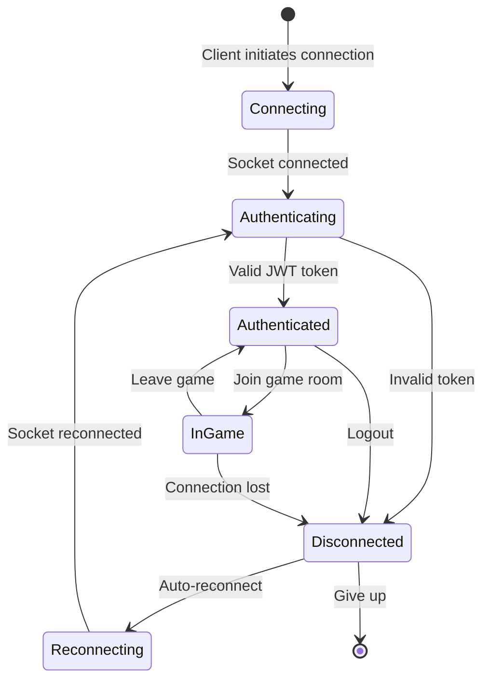

# WebSocket Protocol Documentation
## Real-Time Multiplayer Grid Game

### Version: 1.0
### Protocol: Socket.io v4

---

## Table of Contents
1. [Overview](#overview)
2. [Connection Lifecycle](#connection-lifecycle)
3. [Protocol Design](#protocol-design)
4. [Event Catalog](#event-catalog)
5. [Message Formats](#message-formats)
6. [Error Handling](#error-handling)
7. [Performance Optimization](#performance-optimization)
8. [Security](#security)

---

## Overview

This document defines the WebSocket protocol for real-time communication in the multiplayer grid game. The protocol is built on Socket.io, providing reliable bi-directional communication with automatic reconnection and fallback support.

### Key Features
- **Event-driven architecture**
- **Room-based isolation**
- **Automatic reconnection**
- **Binary data support**
- **Acknowledgment callbacks**

### Protocol Goals
1. **Low Latency**: <100ms for game actions
2. **Reliability**: Message delivery guarantees
3. **Scalability**: Support for 10,000+ concurrent connections
4. **Efficiency**: Minimal bandwidth usage

---

## Connection Lifecycle

### Connection Flow



### Connection Establishment

```javascript
// Client connection with auth
const socket = io('wss://api.gridgame.com', {
    auth: {
        token: 'Bearer eyJhbGciOiJIUzI1NiIs...'
    },
    transports: ['websocket', 'polling'],
    reconnection: true,
    reconnectionDelay: 1000,
    reconnectionDelayMax: 5000,
    reconnectionAttempts: 5,
    timeout: 20000,
    autoConnect: true
});

// Server-side middleware
io.use(async (socket, next) => {
    const token = socket.handshake.auth.token;
    try {
        const user = await verifyJWT(token);
        socket.userId = user.id;
        socket.join(`user:${user.id}`);
        next();
    } catch (err) {
        next(new Error('Authentication failed'));
    }
});
```

### Disconnection Handling

```javascript
// Server-side disconnection
socket.on('disconnect', async (reason) => {
    console.log(`User ${socket.userId} disconnected: ${reason}`);
    
    // Notify other players in the game
    const gameId = await getActiveGame(socket.userId);
    if (gameId) {
        socket.to(`game:${gameId}`).emit('game:player_disconnected', {
            userId: socket.userId,
            timestamp: Date.now()
        });
        
        // Mark player as inactive after timeout
        setTimeout(async () => {
            const isReconnected = await checkUserConnection(socket.userId);
            if (!isReconnected) {
                await markPlayerInactive(gameId, socket.userId);
            }
        }, 30000); // 30 second grace period
    }
});
```

---

## Protocol Design

### Room Architecture

```
Rooms:
├── user:{userId}          # User-specific notifications
├── game:{gameId}          # Game participants
├── game:{gameId}:spectators  # Game spectators
└── lobby                  # General lobby updates
```

### Message Priority System

```typescript
enum MessagePriority {
    CRITICAL = 0,  // Game moves, state changes
    HIGH = 1,      // Player actions
    NORMAL = 2,    // Chat messages
    LOW = 3        // Statistics updates
}

// Priority queue implementation
class PriorityMessageQueue {
    private queues: Map<MessagePriority, Message[]>;
    
    async process() {
        for (let priority = 0; priority <= 3; priority++) {
            const messages = this.queues.get(priority);
            if (messages?.length > 0) {
                await this.sendBatch(messages);
                this.queues.set(priority, []);
            }
        }
    }
}
```

### Namespace Structure

```javascript
// Main game namespace
const gameNamespace = io.of('/game');

// Admin namespace (separate auth)
const adminNamespace = io.of('/admin');

// Spectator namespace (read-only)
const spectatorNamespace = io.of('/spectator');
```

---

## Event Catalog

### Client → Server Events

#### **Authentication Events**

| Event | Description | Payload | Response |
|-------|-------------|---------|----------|
| `authenticate` | Authenticate connection | `{token: string}` | `authenticated` |
| `reauthenticate` | Refresh authentication | `{refreshToken: string}` | `authenticated` |

#### **Game Management Events**

| Event | Description | Payload | Response |
|-------|-------------|---------|----------|
| `game:create` | Create new game | `{boardSize: number, name: string}` | `game:created` |
| `game:join` | Join a game | `{gameId: string, color?: string}` | `game:joined` |
| `game:leave` | Leave current game | `{gameId: string}` | `game:left` |
| `game:start` | Start the game | `{gameId: string}` | `game:started` |
| `game:subscribe` | Subscribe to updates | `{gameId: string}` | `game:state` |

#### **Gameplay Events**

| Event | Description | Payload | Response |
|-------|-------------|---------|----------|
| `game:click_cell` | Claim a cell | `{gameId: string, x: number, y: number}` | `game:cell_claimed` |
| `game:batch_moves` | Multiple moves | `{gameId: string, moves: Move[]}` | `game:batch_result` |
| `game:forfeit` | Forfeit game | `{gameId: string}` | `game:ended` |

#### **Communication Events**

| Event | Description | Payload | Response |
|-------|-------------|---------|----------|
| `chat:message` | Send chat message | `{gameId: string, message: string}` | Broadcast |
| `player:emoji` | Send emoji reaction | `{gameId: string, emoji: string}` | Broadcast |
| `typing:start` | Start typing indicator | `{gameId: string}` | Broadcast |
| `typing:stop` | Stop typing indicator | `{gameId: string}` | Broadcast |

### Server → Client Events

#### **Connection Events**

| Event | Description | Payload |
|-------|-------------|---------|
| `authenticated` | Auth successful | `{userId: string, sessionId: string}` |
| `error` | Error occurred | `{code: string, message: string}` |
| `reconnected` | Reconnection successful | `{missedEvents: Event[]}` |
| `rate_limited` | Rate limit hit | `{retryAfter: number}` |

#### **Game State Events**

| Event | Description | Payload |
|-------|-------------|---------|
| `game:state` | Full game state | `GameState` object |
| `game:created` | Game created | `{gameId: string, inviteCode: string}` |
| `game:joined` | Successfully joined | `{gameId: string, color: string}` |
| `game:started` | Game started | `{gameId: string, firstPlayer: string}` |
| `game:ended` | Game ended | `{winner: User, scores: Record<string, number>}` |

#### **Player Events**

| Event | Description | Payload |
|-------|-------------|---------|
| `game:player_joined` | New player | `{user: User, color: string}` |
| `game:player_left` | Player left | `{userId: string}` |
| `game:player_disconnected` | Player DC'd | `{userId: string}` |
| `game:player_reconnected` | Player back | `{userId: string}` |

#### **Cell Update Events**

| Event | Description | Payload |
|-------|-------------|---------|
| `game:cell_claimed` | Cell claimed | `{x: number, y: number, userId: string, color: string}` |
| `game:cell_failed` | Claim failed | `{x: number, y: number, reason: string}` |
| `game:batch_update` | Multiple updates | `{updates: CellUpdate[]}` |
| `game:board_sync` | Full board state | `{board: string[][]}` |

---

## Message Formats

### Type Definitions

```typescript
// User information
interface User {
    id: string;
    name: string;
    avatarUrl: string;
    color?: string;
}

// Game state
interface GameState {
    id: string;
    name: string;
    boardSize: number;
    status: 'waiting' | 'in_progress' | 'completed';
    players: Player[];
    board: (string | null)[][];
    currentTurn?: string;
    timeRemaining?: number;
    createdAt: number;
    startedAt?: number;
}

// Player in game
interface Player extends User {
    cellsOwned: number;
    isActive: boolean;
    isOnline: boolean;
    joinedAt: number;
}

// Cell update
interface CellUpdate {
    x: number;
    y: number;
    userId: string;
    color: string;
    timestamp: number;
}

// Move request
interface Move {
    x: number;
    y: number;
    timestamp: number;
}

// Error response
interface ErrorResponse {
    code: string;
    message: string;
    details?: any;
    timestamp: number;
}
```

### Binary Protocol (Performance Mode)

For high-frequency updates, use binary format:

```javascript
// Binary message structure (using MessagePack)
const BinaryMessageType = {
    CELL_UPDATE: 0x01,
    BATCH_UPDATE: 0x02,
    GAME_STATE: 0x03
};

// Encoding
const encodeCellUpdate = (update) => {
    const buffer = Buffer.allocUnsafe(13);
    buffer.writeUInt8(BinaryMessageType.CELL_UPDATE, 0);
    buffer.writeUInt16LE(update.x, 1);
    buffer.writeUInt16LE(update.y, 3);
    buffer.write(update.userId, 5, 8, 'hex');
    return buffer;
};

// Decoding
const decodeCellUpdate = (buffer) => {
    return {
        type: buffer.readUInt8(0),
        x: buffer.readUInt16LE(1),
        y: buffer.readUInt16LE(3),
        userId: buffer.toString('hex', 5, 13)
    };
};
```

### Acknowledgment Pattern

```javascript
// Client-side with acknowledgment
socket.emit('game:click_cell', {
    gameId: 'game_2KqJd8Hs9',
    x: 3,
    y: 4
}, (response) => {
    if (response.success) {
        console.log('Cell claimed successfully');
    } else {
        console.error('Failed:', response.error);
    }
});

// Server-side acknowledgment
socket.on('game:click_cell', async (data, callback) => {
    try {
        const result = await claimCell(data);
        callback({ success: true, result });
    } catch (error) {
        callback({ success: false, error: error.message });
    }
});
```

---

## Error Handling

### Error Codes

| Code | Description | Recovery Action |
|------|-------------|-----------------|
| `AUTH_FAILED` | Authentication failed | Re-authenticate |
| `INVALID_TOKEN` | JWT expired/invalid | Refresh token |
| `GAME_NOT_FOUND` | Game doesn't exist | Return to lobby |
| `GAME_FULL` | Game at capacity | Show error |
| `NOT_IN_GAME` | Not a participant | Join game first |
| `CELL_TAKEN` | Cell already owned | Try another cell |
| `INVALID_MOVE` | Invalid coordinates | Validate input |
| `GAME_NOT_STARTED` | Game hasn't started | Wait for start |
| `GAME_ENDED` | Game already over | Return to lobby |
| `RATE_LIMITED` | Too many requests | Backoff & retry |
| `SERVER_ERROR` | Internal error | Retry later |

### Error Message Format

```json
{
    "error": {
        "code": "CELL_TAKEN",
        "message": "This cell has already been claimed",
        "details": {
            "cell": { "x": 3, "y": 4 },
            "owner": "userId123",
            "claimedAt": 1643723456
        },
        "timestamp": 1643723460
    }
}
```

### Client-side Error Handling

```javascript
// Global error handler
socket.on('error', (error) => {
    console.error('Socket error:', error);
    
    switch (error.code) {
        case 'AUTH_FAILED':
            handleAuthFailure();
            break;
        case 'RATE_LIMITED':
            scheduleRetry(error.details.retryAfter);
            break;
        case 'GAME_ENDED':
            redirectToLobby();
            break;
        default:
            showErrorNotification(error.message);
    }
});

// Connection error handler
socket.on('connect_error', (error) => {
    if (socket.active) {
        // Temporary failure, Socket.io will retry
        console.log('Reconnecting...');
    } else {
        // Connection denied by server
        console.error('Connection failed:', error.message);
    }
});
```

---

## Performance Optimization

### Message Batching

```javascript
// Server-side batch processor
class BatchProcessor {
    private updates: Map<string, CellUpdate[]> = new Map();
    private interval: NodeJS.Timer;
    
    constructor(private io: Server) {
        this.interval = setInterval(() => this.flush(), 50); // 50ms batches
    }
    
    addUpdate(gameId: string, update: CellUpdate) {
        if (!this.updates.has(gameId)) {
            this.updates.set(gameId, []);
        }
        this.updates.get(gameId).push(update);
    }
    
    flush() {
        this.updates.forEach((updates, gameId) => {
            if (updates.length > 0) {
                this.io.to(`game:${gameId}`).emit('game:batch_update', {
                    updates,
                    timestamp: Date.now()
                });
            }
        });
        this.updates.clear();
    }
}
```

### Compression

```javascript
// Enable per-message compression
io.on('connection', (socket) => {
    socket.compress(true).emit('game:state', largeGameState);
});

// Client-side compression threshold
socket.on('game:state', { compress: true }, (state) => {
    updateGameState(state);
});
```

### Delta Updates

```javascript
// Send only changed cells
interface DeltaUpdate {
    type: 'delta';
    gameId: string;
    changes: Array<{
        x: number;
        y: number;
        oldValue: string | null;
        newValue: string | null;
    }>;
    version: number;
}

// Client-side delta application
function applyDelta(currentBoard: Board, delta: DeltaUpdate) {
    delta.changes.forEach(change => {
        currentBoard[change.y][change.x] = change.newValue;
    });
    return currentBoard;
}
```

### Connection Pooling

```javascript
// Server-side adapter for scaling
import { createAdapter } from '@socket.io/redis-adapter';
import { createClient } from 'redis';

const pubClient = createClient({
    host: 'redis-cluster.example.com',
    port: 6379
});
const subClient = pubClient.duplicate();

io.adapter(createAdapter(pubClient, subClient));
```

---

## Security

### Authentication & Authorization

```javascript
// JWT verification middleware
const verifyGameAccess = async (socket, gameId) => {
    const userId = socket.userId;
    const participant = await db.gameParticipants.findOne({
        where: { gameId, userId }
    });
    
    if (!participant) {
        throw new Error('Not authorized for this game');
    }
    
    return participant;
};

// Apply to game events
socket.on('game:click_cell', async (data) => {
    try {
        await verifyGameAccess(socket, data.gameId);
        // Process the move
    } catch (error) {
        socket.emit('error', {
            code: 'UNAUTHORIZED',
            message: error.message
        });
    }
});
```

### Input Validation

```javascript
// Validation schemas
const schemas = {
    clickCell: {
        gameId: { type: 'string', pattern: '^game_[A-Za-z0-9]{9}$' },
        x: { type: 'integer', minimum: 0, maximum: 15 },
        y: { type: 'integer', minimum: 0, maximum: 15 }
    }
};

// Validation middleware
const validate = (schema) => (socket, next) => {
    socket.use(([event, data], next) => {
        if (schemas[event]) {
            const valid = ajv.validate(schemas[event], data);
            if (!valid) {
                return next(new Error('Invalid data'));
            }
        }
        next();
    });
    next();
};
```

### Rate Limiting

```javascript
// Per-socket rate limiting
const rateLimiter = new Map();

const rateLimit = (event, maxRequests, windowMs) => {
    return (socket, next) => {
        const key = `${socket.userId}:${event}`;
        const now = Date.now();
        const window = rateLimiter.get(key) || { count: 0, resetAt: now + windowMs };
        
        if (now > window.resetAt) {
            window.count = 0;
            window.resetAt = now + windowMs;
        }
        
        if (window.count >= maxRequests) {
            return next(new Error('Rate limited'));
        }
        
        window.count++;
        rateLimiter.set(key, window);
        next();
    };
};

// Apply rate limits
socket.use(rateLimit('game:click_cell', 10, 1000)); // 10 clicks per second
```

### Message Encryption (Optional)

```javascript
// End-to-end encryption for sensitive data
import { encrypt, decrypt } from './crypto';

// Client-side encryption
const encryptedMessage = encrypt(JSON.stringify({
    gameId: 'game_2KqJd8Hs9',
    move: { x: 3, y: 4 }
}), sharedKey);

socket.emit('game:encrypted_move', encryptedMessage);

// Server-side decryption
socket.on('game:encrypted_move', (encrypted) => {
    const decrypted = decrypt(encrypted, sharedKey);
    const data = JSON.parse(decrypted);
    // Process the move
});
```

---

## Monitoring & Debugging

### Event Logging

```javascript
// Comprehensive event logging
io.on('connection', (socket) => {
    const userId = socket.userId;
    const sessionId = socket.id;
    
    // Log all events
    socket.onAny((event, ...args) => {
        logger.info('Socket event', {
            userId,
            sessionId,
            event,
            timestamp: Date.now()
        });
    });
    
    // Performance metrics
    socket.on('game:click_cell', async (data) => {
        const start = process.hrtime.bigint();
        try {
            await processMove(data);
            const duration = Number(process.hrtime.bigint() - start) / 1e6;
            metrics.histogram('move_processing_time', duration);
        } catch (error) {
            metrics.increment('move_errors');
            throw error;
        }
    });
});
```

### Debug Mode

```javascript
// Client-side debug mode
if (DEBUG_MODE) {
    socket.on('*', (event, data) => {
        console.log(`[Socket.io] ${event}:`, data);
    });
    
    socket.io.on('packet', (packet) => {
        console.log('[Socket.io] Packet:', packet);
    });
}

// Server-side debug
if (process.env.NODE_ENV === 'development') {
    io.use((socket, next) => {
        console.log(`New connection from ${socket.handshake.address}`);
        next();
    });
}
```

### Health Checks

```javascript
// WebSocket health endpoint
app.get('/ws/health', (req, res) => {
    const stats = {
        connected: io.sockets.sockets.size,
        rooms: io.sockets.adapter.rooms.size,
        uptime: process.uptime(),
        memory: process.memoryUsage(),
        timestamp: Date.now()
    };
    res.json(stats);
});
```

---

## Best Practices

### Do's
1. ✅ Always validate input data
2. ✅ Use acknowledgments for critical events
3. ✅ Implement proper error handling
4. ✅ Batch updates when possible
5. ✅ Use rooms for efficient broadcasting
6. ✅ Implement heartbeat/keepalive
7. ✅ Log important events for debugging
8. ✅ Use compression for large payloads

### Don'ts
1. ❌ Don't send sensitive data in plain text
2. ❌ Don't trust client-provided timestamps
3. ❌ Don't broadcast to all connected clients
4. ❌ Don't store large data in socket objects
5. ❌ Don't ignore disconnection events
6. ❌ Don't skip rate limiting
7. ❌ Don't use synchronous operations
8. ❌ Don't forget to clean up resources

### Code Examples

```javascript
// ✅ Good: Proper room management
socket.on('game:join', async (data) => {
    const { gameId } = data;
    
    // Leave other game rooms
    const rooms = Array.from(socket.rooms);
    rooms.forEach(room => {
        if (room.startsWith('game:') && room !== `game:${gameId}`) {
            socket.leave(room);
        }
    });
    
    // Join new game room
    socket.join(`game:${gameId}`);
    
    // Notify others
    socket.to(`game:${gameId}`).emit('game:player_joined', {
        user: await getUserInfo(socket.userId)
    });
});

// ❌ Bad: Memory leak
socket.on('game:join', (data) => {
    // This creates a new listener each time!
    socket.on('game:move', (move) => {
        processMove(data.gameId, move);
    });
});
```